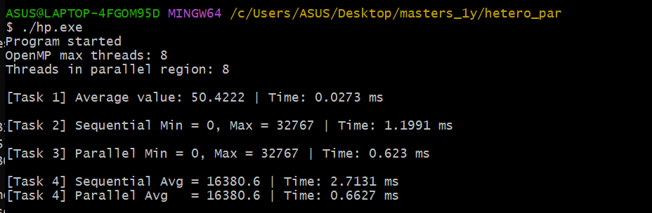
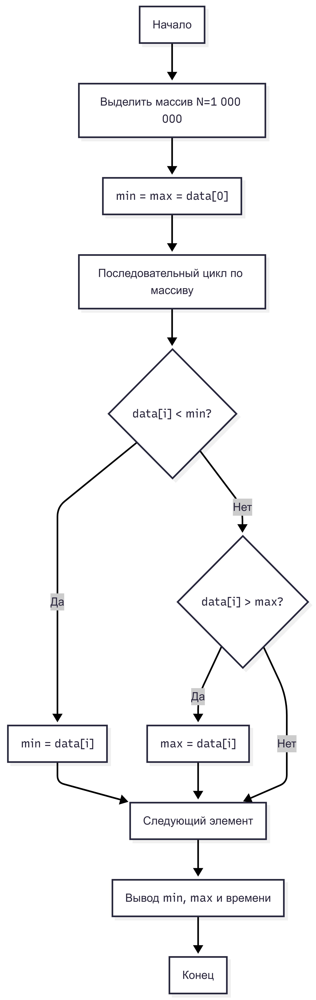
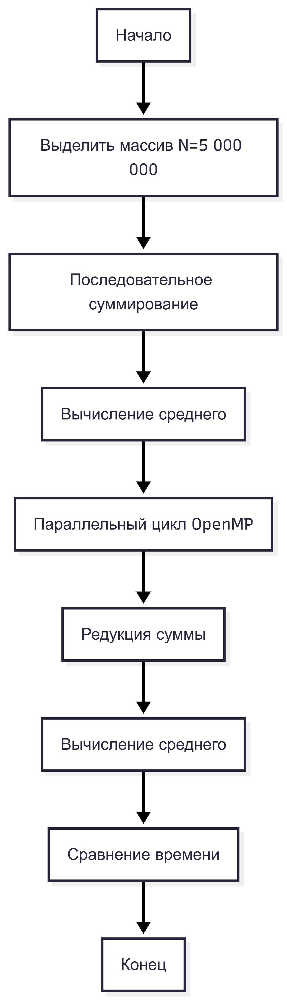

# Assignment 1

## Описание задания

В этом проекте я изучала работу с динамической памятью в языке программирования **C++**, а также анализировала различия между последовательными и параллельными алгоритмами обработки массивов с использованием технологии **OpenMP**.

Что я реализовала:

- динамическое выделение и освобождение памяти
- обработку массивов большого размера
- последовательные и параллельные алгоритмы
- измерение времени выполнения программ
- сравнение производительности последовательных и параллельных реализаций

---

## Задание 1 — Динамический массив и среднее значение

### Цель

Я написала программу на C++, которая:

- динамически выделяет массив из **50 000 целых чисел**
- заполняет массив случайными значениями в диапазоне **[1, 100]**
- вычисляет среднее арифметическое элементов массива
- корректно освобождает выделенную динамическую память

### Основные технологии

- динамическая память: `new[] / delete[]`
- генерация случайных чисел
- последовательное вычисление среднего значения

### Блок-схема


### Скриншот программы



---

## Задание 2 — Последовательный поиск min/max

### Цель

Я создала массив из **1 000 000 целых чисел** и реализовала:

- последовательный алгоритм поиска минимального и максимального элементов
- измерение времени выполнения алгоритма

### Измерение времени

Для измерения времени выполнения я использовала стандартную библиотеку:

```cpp
#include <chrono>
```

### Блок-схема



---

## Задание 3 — Параллельный поиск min/max с OpenMP

### Цель

Используя технологию **OpenMP**, я реализовала параллельный алгоритм поиска минимального и максимального элементов массива и сравнила его производительность с последовательной реализацией.

### Используемые конструкции OpenMP

- `#pragma omp parallel for`
- `reduction(min: ...)`, `reduction(max: ...)`

### Особенность

Каждый поток обрабатывает свою часть массива и вычисляет локальные значения минимума и максимума, которые затем объединяются с использованием механизма редукции.

### Блок-схема


---

## Задание 4 — Среднее значение с OpenMP и reduction

### Цель

Я создала массив из **5 000 000 элементов** и реализовала:

- последовательное вычисление среднего значения
- параллельное вычисление среднего значения с использованием механизма `reduction`
- сравнение времени выполнения обеих реализаций

### Ключевая директива OpenMP

```cpp
#pragma omp parallel for reduction(+:sum)
```

### Блок-схема



---

## Компиляция и запуск

### Компилятор

GCC с поддержкой OpenMP (MSYS2 MinGW64).

### Компиляция

```bash
g++ -std=c++17 -fopenmp main.cpp -O2 -o main.exe
```

### Запуск

```bash
./main.exe
```

---

## Контрольные вопросы к Assignment 1

*(Основы C/C++ и OpenMP)*

**1. В чём отличие динамического массива от статического массива в языке C++?**

Статический массив имеет фиксированный размер, задаваемый на этапе компиляции. Динамический массив создаётся во время выполнения программы в куче и позволяет гибко управлять размером памяти.

**2. Что такое указатель и зачем он используется при работе с динамической памятью?**

Указатель хранит адрес области памяти и используется для доступа к динамически выделенной памяти.

**3. Почему важно корректно освобождать память после использования динамических массивов?**

Неосвобождённая память приводит к утечкам памяти и снижению производительности программы.

**4. В чём разница между последовательной и параллельной обработкой массива?**

Последовательная обработка выполняется одним потоком, тогда как параллельная распределяет вычисления между несколькими потоками.

**5. Что делает директива `#pragma omp parallel for`?**

Она автоматически распределяет итерации цикла между потоками для параллельного выполнения.

**6. Для чего используется механизм `reduction` в OpenMP?**

Для корректного объединения частичных результатов, вычисленных в разных потоках.

**7. Почему при параллельном вычислении суммы необходимо использовать `reduction`?**

Это предотвращает состояние гонки и обеспечивает корректность вычислений.

**8. Какие факторы могут привести к тому, что параллельная версия будет работать медленнее?**

Накладные расходы на создание и синхронизацию потоков, небольшой объём данных и простота вычислений.

---

## Вывод

В ходе выполнения Assignment 1 я изучила основы работы с динамической памятью в языке C++, а также принципы последовательной и параллельной обработки массивов с использованием технологии OpenMP. Полученные мной результаты показали, что параллельные алгоритмы обеспечивают ускорение при достаточном размере задачи, однако при небольших вычислительных нагрузках накладные расходы могут нивелировать преимущество параллелизации.