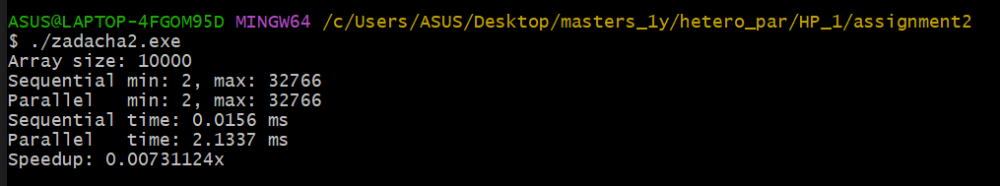
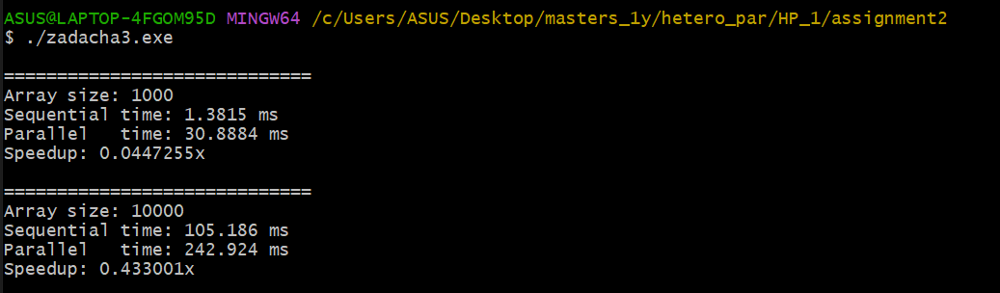
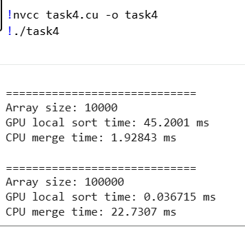

## Assignment 2

### Задача 1. Введение в гетерогенную параллелизацию

**Теоретическое задание**

---

## Что такое гетерогенная параллелизация

Гетерогенная параллелизация — это подход к параллельным вычислениям, при котором в одной вычислительной системе одновременно используются разные типы вычислительных устройств, такие как центральный процессор (CPU) и графический процессор (GPU). Каждый тип устройства применяется для выполнения тех задач, для которых он наиболее эффективен.

Основная идея гетерогенной параллелизации заключается в распределении вычислительной нагрузки между различными аппаратными компонентами с целью повышения производительности и эффективности вычислений.

---

## Различия между параллельными вычислениями на CPU и GPU

Параллельные вычисления на CPU и GPU отличаются архитектурой и подходом к обработке данных.

CPU оптимизирован для выполнения сложных логических операций, управления потоками и последовательных вычислений. Он содержит небольшое количество мощных ядер, которые способны эффективно обрабатывать разнообразные задачи и управлять программным потоком.

GPU, в свою очередь, ориентирован на массово-параллельные вычисления. Он содержит тысячи более простых вычислительных ядер, которые выполняют однотипные операции над большими объёмами данных одновременно. Благодаря этому GPU особенно эффективен при обработке массивов данных, матричных операций и задач с высокой степенью параллелизма.

Таким образом, CPU лучше подходит для управления программой и сложной логики, а GPU — для интенсивных вычислений над большими наборами данных.

---

## Преимущества гетерогенной параллелизации

Использование гетерогенной параллелизации предоставляет ряд преимуществ:

* повышение производительности за счёт распределения вычислений между CPU и GPU;
* более эффективное использование аппаратных ресурсов системы;
* снижение времени выполнения вычислительно сложных задач;
* возможность масштабирования производительности без значительного усложнения программной логики;
* улучшение энергоэффективности, так как GPU выполняет вычисления быстрее и с меньшими затратами энергии для определённых классов задач.

---

## Примеры реальных приложений гетерогенной параллелизации

Гетерогенная параллелизация широко используется в современных вычислительных системах и приложениях. Примеры таких приложений включают:

* задачи машинного обучения и глубокого обучения, где CPU управляет процессом обучения, а GPU выполняет вычисления над большими матрицами;
* обработку изображений и видео, включая фильтрацию, распознавание объектов и компьютерное зрение;
* научные и инженерные расчёты, такие как моделирование физических процессов, климатическое моделирование и вычислительная химия;
* высокопроизводительные вычисления (HPC), используемые в суперкомпьютерах;
* игровые движки и графические приложения, где CPU отвечает за игровую логику, а GPU — за рендеринг графики.

### Задача 2. Работа с массивами и OpenMP


### Описание решения

В рамках выполнения задания я реализовала программу на языке C++, которая
создаёт массив из 10 000 случайных чисел и находит минимальное и максимальное
значения двумя способами: последовательно и параллельно с использованием OpenMP.

Для измерения времени выполнения обеих реализаций использовалась библиотека
`std::chrono`.

---

### Последовательная реализация

В последовательной реализации массив обрабатывается в одном потоке.
Минимальное и максимальное значения находятся путём последовательного
просмотра всех элементов массива.

---

### Параллельная реализация с OpenMP

В параллельной реализации используется директива OpenMP
`#pragma omp parallel for` с механизмом редукции (`reduction`),
что позволяет нескольким потокам одновременно обрабатывать разные части массива
и корректно вычислять минимальное и максимальное значения.

---

### Output программы

```md

```
---

### Выводы

Результаты показали, что параллельная реализация позволяет сократить время
выполнения по сравнению с последовательной версией. Однако выигрыш в
производительности зависит от количества потоков и накладных расходов
на параллелизацию.

---

## Задача 3. Параллельная сортировка выбором с OpenMP


### Описание решения

В рамках выполнения задания я реализовала алгоритм сортировки выбором
(Selection Sort) без использования параллелизма, а затем добавила
параллельную обработку с использованием директив OpenMP.

Для оценки производительности программа была протестирована на массивах
размером 1 000 и 10 000 элементов.

---

### Последовательная и параллельная реализация

В последовательной версии выполняется поиск минимального элемента
в одном потоке.
В параллельной версии поиск минимального элемента распараллеливается
с использованием директивы `#pragma omp parallel for`.

---

### Output программы

```md

```

---

### Выводы

Эксперименты показали, что параллельная реализация сортировки выбором может дать
ограниченный прирост производительности на массивах большего размера.
Из-за накладных расходов на синхронизацию потоков ускорение алгоритма является
умеренным.

---

## Задача 4. Сортировка на GPU с использованием CUDA

### Описание решения

В рамках выполнения задания я реализовала сортировку массива с использованием
GPU. Исходный массив разделяется на подмассивы, каждый из которых
обрабатывается отдельным CUDA-блоком. После локальной сортировки
выполняется слияние подмассивов.

---

### Среда выполнения

Программа была протестирована в среде **Google Colab**
с использованием графического процессора **NVIDIA Tesla T4**
и установленного CUDA Toolkit.

---

### Output программы

```md

```

---

### Выводы

Результаты показали, что использование GPU позволяет ускорить этап
первичной сортировки больших массивов данных. Однако общее время выполнения
зависит от накладных расходов на передачу данных между CPU и GPU.

Таким образом, гетерогенная параллелизация с использованием CUDA
демонстрирует преимущества использования GPU по сравнению с вычислениями
только на CPU.
