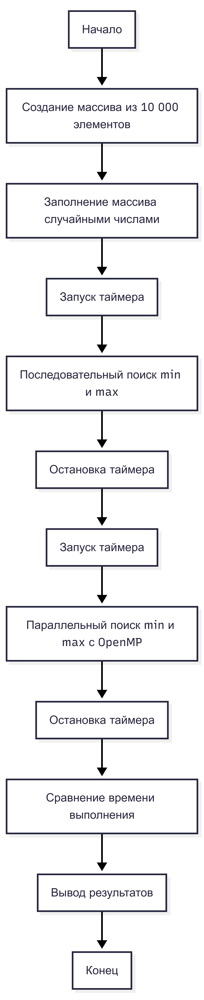
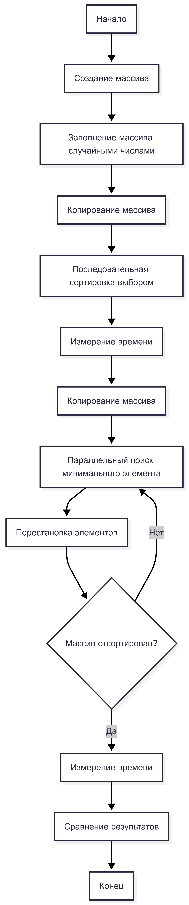
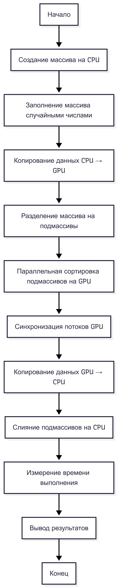

## Assignment 2

### Задача 1. Введение в гетерогенную параллелизацию

**Теоретическое задание**

---

## Что такое гетерогенная параллелизация

Гетерогенная параллелизация — это подход к параллельным вычислениям, при котором в одной вычислительной системе одновременно используются разные типы вычислительных устройств, такие как центральный процессор (CPU) и графический процессор (GPU). Каждый тип устройства применяется для выполнения тех задач, для которых он наиболее эффективен.

Основная идея гетерогенной параллелизации заключается в распределении вычислительной нагрузки между различными аппаратными компонентами с целью повышения производительности и эффективности вычислений.

---

## Различия между параллельными вычислениями на CPU и GPU

Параллельные вычисления на CPU и GPU отличаются архитектурой и подходом к обработке данных.

CPU оптимизирован для выполнения сложных логических операций, управления потоками и последовательных вычислений. Он содержит небольшое количество мощных ядер, которые способны эффективно обрабатывать разнообразные задачи и управлять программным потоком.

GPU, в свою очередь, ориентирован на массово-параллельные вычисления. Он содержит тысячи более простых вычислительных ядер, которые выполняют однотипные операции над большими объёмами данных одновременно. Благодаря этому GPU особенно эффективен при обработке массивов данных, матричных операций и задач с высокой степенью параллелизма.

Таким образом, CPU лучше подходит для управления программой и сложной логики, а GPU — для интенсивных вычислений над большими наборами данных.

---

## Преимущества гетерогенной параллелизации

Использование гетерогенной параллелизации предоставляет ряд преимуществ:

* повышение производительности за счёт распределения вычислений между CPU и GPU;
* более эффективное использование аппаратных ресурсов системы;
* снижение времени выполнения вычислительно сложных задач;
* возможность масштабирования производительности без значительного усложнения программной логики;
* улучшение энергоэффективности, так как GPU выполняет вычисления быстрее и с меньшими затратами энергии для определённых классов задач.

---

## Примеры реальных приложений гетерогенной параллелизации

Гетерогенная параллелизация широко используется в современных вычислительных системах и приложениях. Примеры таких приложений включают:

* задачи машинного обучения и глубокого обучения, где CPU управляет процессом обучения, а GPU выполняет вычисления над большими матрицами;
* обработку изображений и видео, включая фильтрацию, распознавание объектов и компьютерное зрение;
* научные и инженерные расчёты, такие как моделирование физических процессов, климатическое моделирование и вычислительная химия;
* высокопроизводительные вычисления (HPC), используемые в суперкомпьютерах;
* игровые движки и графические приложения, где CPU отвечает за игровую логику, а GPU — за рендеринг графики.

### Задача 2. Работа с массивами и OpenMP

### Описание решения

В рамках выполнения задания я реализовала программу на языке C++, которая
создаёт массив из 10 000 случайных чисел и находит минимальное и максимальное
значения двумя способами: последовательно и параллельно с использованием OpenMP.

Для измерения времени выполнения обеих реализаций использовалась библиотека
`std::chrono`.

---

### Последовательная реализация

В последовательной реализации массив обрабатывается в одном потоке.
Минимальное и максимальное значения находятся путём последовательного
просмотра всех элементов массива.

---

### Параллельная реализация с OpenMP

В параллельной реализации используется директива OpenMP
`#pragma omp parallel for` с механизмом редукции (`reduction`),
что позволяет нескольким потокам одновременно обрабатывать разные части массива
и корректно вычислять минимальное и максимальное значения.

---

### Output программы

---

### Блок-схема
Блок-схема отражает последовательную и параллельную реализацию поиска минимального и максимального значений массива с использованием OpenMP.

---

### Выводы

Результаты показали, что параллельная реализация позволяет сократить время
выполнения по сравнению с последовательной версией. Однако выигрыш в
производительности зависит от количества потоков и накладных расходов
на параллелизацию.

---

## Задача 3. Параллельная сортировка выбором с OpenMP

### Описание решения

В рамках выполнения задания я реализовала алгоритм сортировки выбором
(Selection Sort) без использования параллелизма, а затем добавила
параллельную обработку с использованием директив OpenMP.

Для оценки производительности программа была протестирована на массивах
размером 1 000 и 10 000 элементов.

---

### Последовательная и параллельная реализация

В последовательной версии выполняется поиск минимального элемента
в одном потоке.
В параллельной версии поиск минимального элемента распараллеливается
с использованием директивы `#pragma omp parallel for`.

---

### Output программы

---
### Блок-схема

В параллельной версии алгоритма поиск минимального элемента выполняется с использованием OpenMP, тогда как перестановка элементов остаётся последовательной.

---

### Выводы

Эксперименты показали, что параллельная реализация сортировки выбором может дать
ограниченный прирост производительности на массивах большего размера.
Из-за накладных расходов на синхронизацию потоков ускорение алгоритма является
умеренным.

---

## Задача 4. Сортировка на GPU с использованием CUDA

### Описание решения

В рамках выполнения задания я реализовала сортировку массива с использованием
GPU. Исходный массив разделяется на подмассивы, каждый из которых
обрабатывается отдельным CUDA-блоком. После локальной сортировки
выполняется слияние подмассивов.

---

### Среда выполнения

Программа была протестирована в среде **Google Colab**
с использованием графического процессора **NVIDIA Tesla T4**
и установленного CUDA Toolkit.

---

### Output программы

---

### Блок-схема

Данная блок-схема отражает гетерогенный подход, при котором GPU используется для параллельной сортировки подмассивов, а CPU — для финального слияния данных.

---

### Выводы

Результаты показали, что использование GPU позволяет ускорить этап
первичной сортировки больших массивов данных. Однако общее время выполнения
зависит от накладных расходов на передачу данных между CPU и GPU.

Таким образом, гетерогенная параллелизация с использованием CUDA
демонстрирует преимущества использования GPU по сравнению с вычислениями
только на CPU.

---

## Контрольные вопросы к Assignment 2

**(OpenMP, CUDA и гетерогенные вычисления)**

### 1. Что понимается под гетерогенной параллелизацией?

Гетерогенная параллелизация — это подход к вычислениям, при котором в рамках одной программы используются различные типы вычислительных устройств, такие как CPU и GPU. Каждое устройство применяется для выполнения тех частей задачи, для которых оно наиболее эффективно, что позволяет повысить общую производительность системы.

---

### 2. В чём принципиальные различия архитектур CPU и GPU?

CPU состоит из небольшого количества мощных универсальных ядер и оптимизирован для выполнения сложной логики, управления потоками и последовательных вычислений. GPU содержит большое количество более простых вычислительных ядер и ориентирован на массово-параллельную обработку данных, выполняя однотипные операции над большими массивами данных одновременно.

---

### 3. Какие типы задач лучше подходят для выполнения на GPU, а какие — на CPU?

GPU лучше подходит для задач с высокой степенью параллелизма, таких как обработка изображений, машинное обучение, матричные операции и сортировка больших массивов данных. CPU более эффективен для задач с сложной логикой управления, ветвлениями, а также для последовательных и плохо распараллеливаемых алгоритмов.

---

### 4. Почему не все алгоритмы эффективно распараллеливаются с использованием OpenMP?

Не все алгоритмы можно эффективно распараллелить из-за наличия зависимостей между итерациями, когда результат одного шага зависит от предыдущего. В таких случаях параллельное выполнение может привести к некорректным результатам или значительным накладным расходам на синхронизацию потоков.

---

### 5. В чём заключается основная идея алгоритма сортировки слиянием?

Основная идея сортировки слиянием заключается в рекурсивном разбиении массива на меньшие подмассивы, их независимой сортировке и последующем слиянии отсортированных подмассивов в один упорядоченный массив. Алгоритм имеет сложность `O(n log n)` и хорошо подходит для параллельной реализации.

---

### 6. Какие сложности возникают при реализации сортировки слиянием на GPU?

При реализации сортировки слиянием на GPU возникают сложности, связанные с синхронизацией потоков, эффективным распределением памяти и организацией параллельного слияния подмассивов. Также существенную роль играют накладные расходы на передачу данных между памятью CPU и GPU.

---

### 7. Как выбор размера блока и сетки влияет на производительность вычислений на GPU?

Размер блока и сетки определяет количество потоков, выполняемых одновременно на GPU. Слишком малый размер блока приводит к неэффективному использованию вычислительных ресурсов, а слишком большой — к превышению ограничений аппаратуры. Оптимальный выбор параметров позволяет максимально загрузить GPU и повысить производительность.

---

### 8. Почему гетерогенный подход может быть эффективнее использования только CPU или только GPU?

Гетерогенный подход позволяет распределить вычисления между CPU и GPU в зависимости от их архитектурных особенностей. CPU эффективно выполняет задачи управления и последовательной логики, а GPU — вычислительно интенсивные параллельные операции. Такое сочетание позволяет снизить общее время выполнения и более эффективно использовать ресурсы системы.
