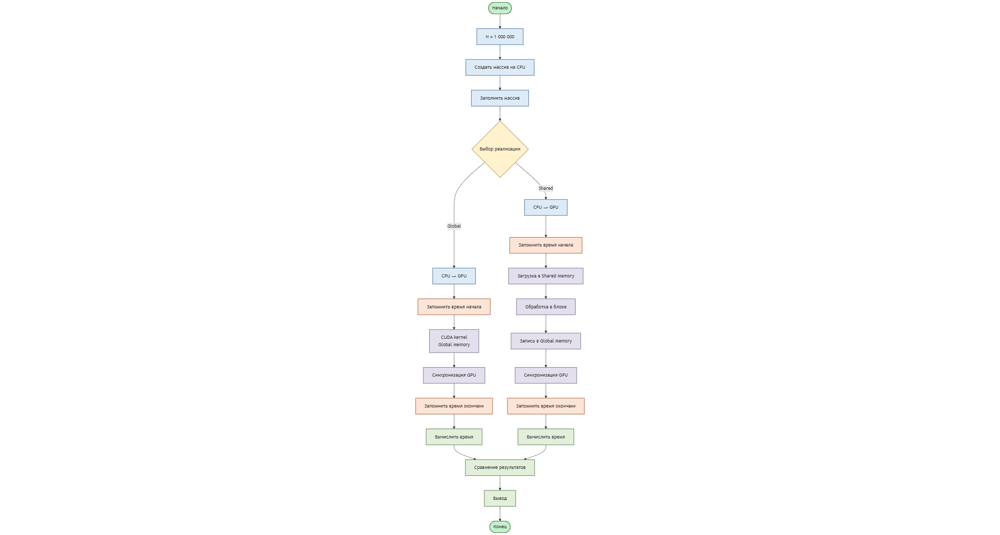
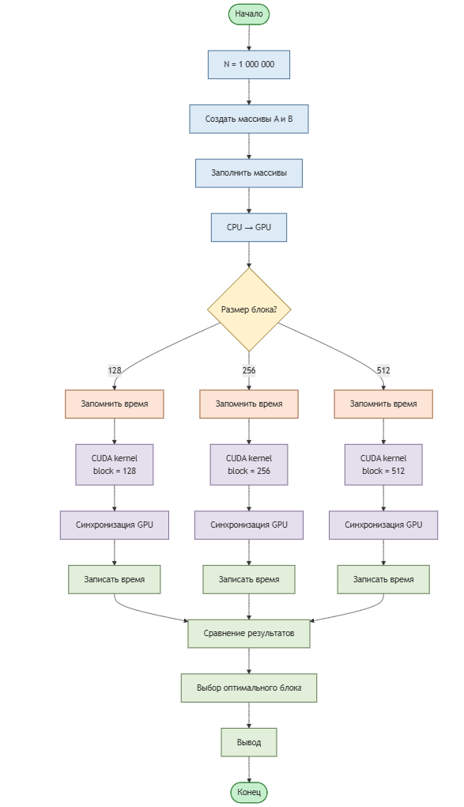
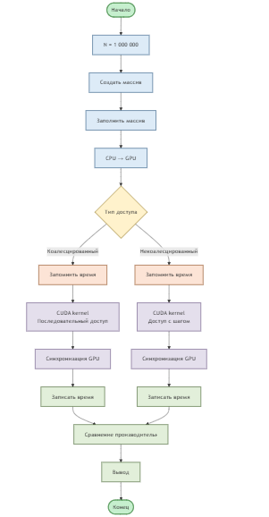
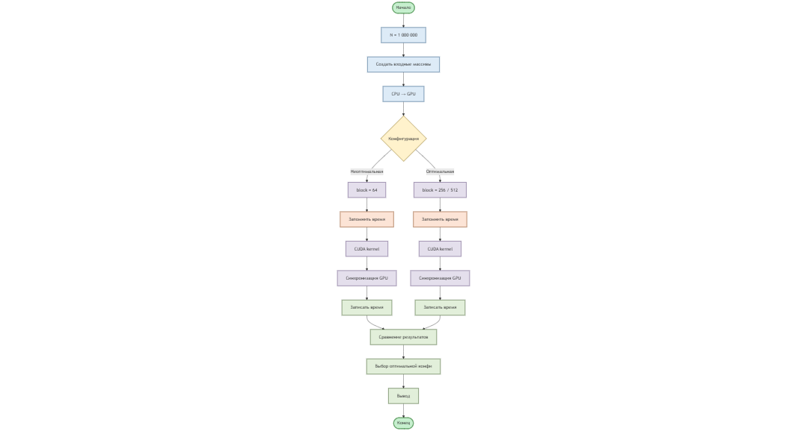

### Блок-схемы

Блок схема 1 задания

Блок схема 2 задания

Блок схема 3 задания

Блок схема 4 задания

Контрольные вопросы к Assignment 3

(CUDA и архитектура GPU)

1. Какие основные типы памяти существуют в архитектуре CUDA и чем они отличаются по скорости доступа?

В архитектуре CUDA используются глобальная, разделяемая, локальная, константная и регистровая память. Регистры и разделяемая память имеют наименьшую задержку доступа и используются внутри потоков и блоков. Глобальная память обладает наибольшей задержкой, но доступна всем потокам и имеет большой объём. Константная память оптимизирована для чтения и используется при неизменяемых данных.

2. В каких случаях использование разделяемой памяти позволяет ускорить выполнение CUDA-программы?

Разделяемая память позволяет ускорить выполнение программы в случаях, когда данные многократно используются потоками одного блока. Перемещение данных из глобальной памяти в разделяемую снижает количество медленных обращений к глобальной памяти и уменьшает задержки доступа.

3. Как шаблон доступа к глобальной памяти влияет на производительность GPU-программы?

Шаблон доступа к глобальной памяти напрямую влияет на эффективность использования пропускной способности памяти. Коалесцированный доступ, при котором соседние потоки обращаются к соседним адресам памяти, обеспечивает высокую производительность. Некоалесцированный доступ приводит к увеличению числа транзакций памяти и снижению производительности.

4. Почему одинаковый алгоритм на GPU может показывать разное время выполнения при разных способах обращения к памяти?

Разное время выполнения связано с различной эффективностью использования памяти. Даже при одинаковом алгоритме неэффективный доступ к глобальной памяти может значительно увеличить задержки и снизить пропускную способность, что приводит к ухудшению общей производительности.

5. Как размер блока потоков влияет на производительность CUDA-ядра?

Размер блока потоков определяет количество потоков, выполняемых одновременно на мультипроцессоре GPU. Слишком маленький блок приводит к недостаточной загрузке вычислительных ресурсов, а слишком большой — к ограничению по доступным регистрам и разделяемой памяти. Оптимальный размер блока позволяет максимально эффективно использовать ресурсы GPU.

6. Что такое варп и почему важно учитывать его при разработке CUDA-программ?

Варп — это группа из 32 потоков, которые выполняются синхронно на GPU. Важно учитывать варпы, так как расхождение ветвлений внутри варпа (warp divergence) приводит к последовательному выполнению веток и снижению производительности.

7. Какие факторы необходимо учитывать при выборе конфигурации сетки и блоков потоков?

При выборе конфигурации необходимо учитывать архитектуру GPU, размер задачи, использование регистров и разделяемой памяти, а также требования к коалесцированному доступу к памяти. Целью является достижение максимальной загрузки вычислительных ресурсов при минимальных накладных расходах.

8. Почему оптимизация CUDA-программы часто начинается с анализа работы с памятью, а не с изменения алгоритма?

Во многих CUDA-программах производительность ограничена пропускной способностью памяти, а не вычислительными возможностями GPU. Оптимизация доступа к памяти, уменьшение количества обращений к глобальной памяти и использование разделяемой памяти часто дают больший прирост производительности, чем изменение самого алгоритма.