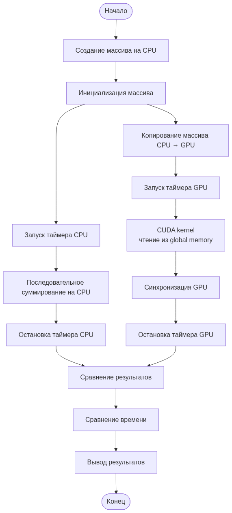
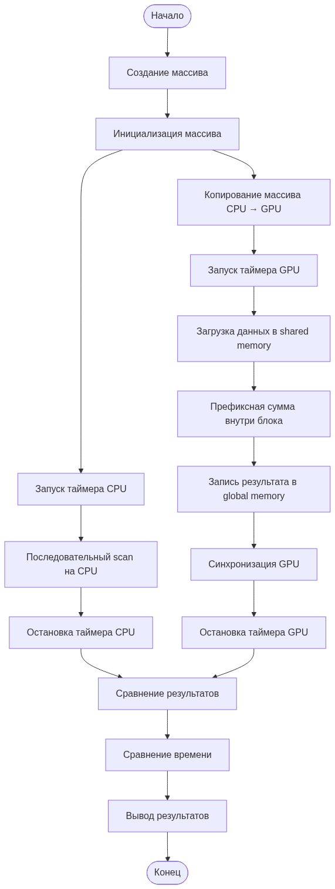
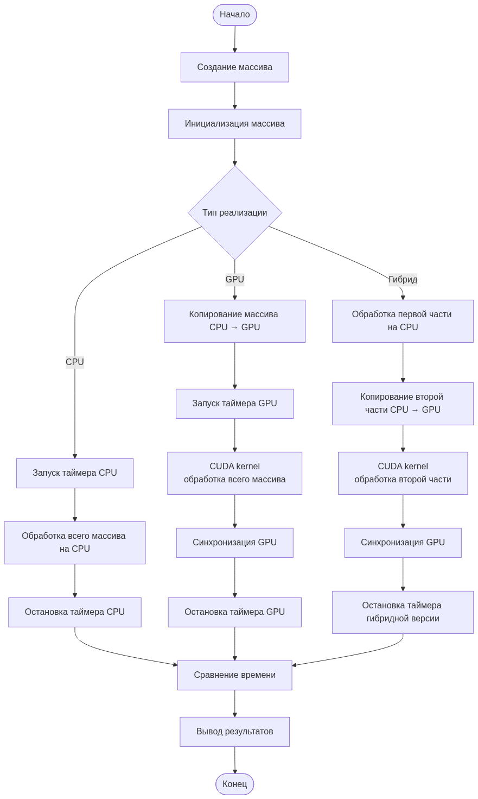
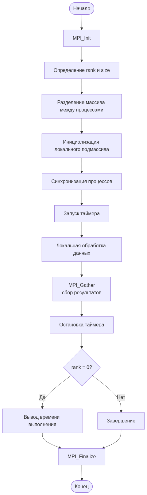

### Блок-схемы

Блок схема 1 задания

Блок схема 2 задания

Блок схема 3 задания

Блок схема 4 задания

Контрольные вопросы к Assignment 3

1. В чём заключается отличие гибридных вычислений от вычислений только на CPU или только на GPU?

Гибридные вычисления предполагают совместное использование ресурсов CPU и GPU в рамках одной программы. В отличие от вычислений только на CPU или только на GPU, гибридный подход позволяет распределять различные части задачи между процессорами с учётом их архитектурных особенностей, что может повысить общую производительность.

2. Для каких типов задач целесообразно распределять вычисления между CPU и GPU?

Распределение вычислений между CPU и GPU целесообразно для задач, содержащих как последовательные, так и массово-параллельные этапы. CPU эффективно выполняет управляющую логику и задачи с ветвлениями, тогда как GPU хорошо подходит для обработки больших массивов данных с однотипными операциями.

3. В чём разница между синхронной и асинхронной передачей данных между CPU и GPU?

При синхронной передаче данных выполнение программы приостанавливается до завершения операции копирования. Асинхронная передача позволяет перекрывать передачу данных с вычислениями, не блокируя выполнение программы, что повышает эффективность использования ресурсов.

4. Почему асинхронная передача данных может повысить производительность программы?

Асинхронная передача данных позволяет выполнять вычисления на CPU или GPU параллельно с копированием данных. Это снижает время простоя вычислительных устройств и уменьшает суммарное время выполнения программы.

5. Какие основные функции MPI используются для распределения и сбора данных между процессами?

Для распределения и сбора данных в MPI используются функции коллективного взаимодействия, такие как MPI_Scatter для распределения данных между процессами и MPI_Gather для сбора результатов. Также часто применяется MPI_Bcast для широковещательной передачи данных.

6. Как количество процессов MPI влияет на время выполнения программы и почему?

Увеличение количества процессов MPI может сократить время выполнения за счёт параллельной обработки данных. Однако при большом числе процессов возрастает объём коммуникаций и накладные расходы на синхронизацию, что может ограничивать ускорение.

7. Какие факторы ограничивают масштабируемость распределённых параллельных программ?

Масштабируемость ограничивается накладными расходами на коммуникацию между процессами, задержками сети, неравномерным распределением нагрузки, а также последовательными участками алгоритма, которые невозможно распараллелить.

8. В каких случаях использование распределённых вычислений оправдано, а в каких — неэффективно?

Распределённые вычисления оправданы для задач с большим объёмом данных и высокой степенью параллелизма, где вычислительные затраты превышают накладные расходы на коммуникацию. Для небольших задач или задач с интенсивным обменом данными распределённый подход может быть неэффективным.