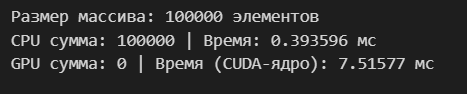
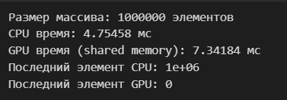

# Assignment 4  
## Гибридные и распределённые параллельные вычисления

---

## Цель работы

Целью данного задания является изучение гибридных и распределённых параллельных вычислений, включая использование GPU с помощью CUDA, совместную обработку данных на CPU и GPU, а также распределённые вычисления с применением MPI.

---

## Среда выполнения

- Среда: Google Colab  
- GPU: NVIDIA Tesla T4  
- Язык программирования: CUDA C++, C++  
- Библиотеки: CUDA Runtime, MPI  
- Компиляция CUDA: `nvcc -arch=sm_75`

---

## Задание 1. Суммирование массива на GPU

### Описание

Реализована CUDA-программа для вычисления суммы элементов массива с использованием глобальной памяти GPU. Результаты и время выполнения сравнивались с последовательной реализацией на CPU для массива размером 100 000 элементов.

### Результаты выполнения

### Диаграмма алгоритма

### Вывод

GPU-реализация позволяет выполнять суммирование массива параллельно, однако для относительно небольших массивов выигрыш в производительности может быть ограничен накладными расходами на запуск CUDA-ядер.

---

## Задание 2. Префиксная сумма с использованием разделяемой памяти

### Описание

Реализована CUDA-программа для вычисления префиксной суммы массива с использованием разделяемой памяти. Выполнено сравнение времени выполнения с последовательной реализацией на CPU для массива размером 1 000 000 элементов.

### Результаты выполнения

### Диаграмма алгоритма

### Вывод

Использование разделяемой памяти позволяет уменьшить число обращений к глобальной памяти и повысить эффективность вычислений по сравнению с последовательной реализацией на CPU.

---

## Задание 3. Гибридная обработка данных (CPU + GPU)

### Описание

Реализована гибридная программа, в которой массив данных разделяется на две части: первая часть обрабатывается на CPU, вторая — на GPU. Выполнено сравнение времени выполнения CPU-, GPU- и гибридной реализаций.

### Результаты выполнения

### Диаграмма алгоритма

### Вывод

Гибридный подход позволяет эффективно использовать ресурсы CPU и GPU одновременно, что может привести к сокращению общего времени выполнения по сравнению с использованием только одного вычислительного устройства.

---

## Задание 4. Распределённые вычисления с использованием MPI

### Описание

Реализована распределённая программа с использованием MPI, в которой массив данных разделяется между несколькими процессами. Каждый процесс выполняет локальные вычисления, после чего результаты собираются в одном процессе. Проведены замеры времени выполнения для 2, 4 и 8 процессов.

### Диаграмма алгоритма

### Вывод

Увеличение числа MPI-процессов позволяет сократить время выполнения за счёт распределения вычислительной нагрузки, однако эффективность масштабирования ограничивается накладными расходами на коммуникацию между процессами.

---

## Общие выводы

В ходе выполнения Assignment 4 были изучены подходы к гибридным и распределённым параллельным вычислениям. Эксперименты показали, что комбинирование CPU, GPU и распределённых вычислений позволяет более эффективно использовать вычислительные ресурсы, особенно при обработке больших объёмов данных.

---

Контрольные вопросы к Assignment 4

1. В чём заключается отличие гибридных вычислений от вычислений только на CPU или только на GPU?

Гибридные вычисления предполагают совместное использование ресурсов CPU и GPU в рамках одной программы. В отличие от вычислений только на CPU или только на GPU, гибридный подход позволяет распределять различные части задачи между процессорами с учётом их архитектурных особенностей, что может повысить общую производительность.

2. Для каких типов задач целесообразно распределять вычисления между CPU и GPU?

Распределение вычислений между CPU и GPU целесообразно для задач, содержащих как последовательные, так и массово-параллельные этапы. CPU эффективно выполняет управляющую логику и задачи с ветвлениями, тогда как GPU хорошо подходит для обработки больших массивов данных с однотипными операциями.

3. В чём разница между синхронной и асинхронной передачей данных между CPU и GPU?

При синхронной передаче данных выполнение программы приостанавливается до завершения операции копирования. Асинхронная передача позволяет перекрывать передачу данных с вычислениями, не блокируя выполнение программы, что повышает эффективность использования ресурсов.

4. Почему асинхронная передача данных может повысить производительность программы?

Асинхронная передача данных позволяет выполнять вычисления на CPU или GPU параллельно с копированием данных. Это снижает время простоя вычислительных устройств и уменьшает суммарное время выполнения программы.

5. Какие основные функции MPI используются для распределения и сбора данных между процессами?

Для распределения и сбора данных в MPI используются функции коллективного взаимодействия, такие как MPI_Scatter для распределения данных между процессами и MPI_Gather для сбора результатов. Также часто применяется MPI_Bcast для широковещательной передачи данных.

6. Как количество процессов MPI влияет на время выполнения программы и почему?

Увеличение количества процессов MPI может сократить время выполнения за счёт параллельной обработки данных. Однако при большом числе процессов возрастает объём коммуникаций и накладные расходы на синхронизацию, что может ограничивать ускорение.

7. Какие факторы ограничивают масштабируемость распределённых параллельных программ?

Масштабируемость ограничивается накладными расходами на коммуникацию между процессами, задержками сети, неравномерным распределением нагрузки, а также последовательными участками алгоритма, которые невозможно распараллелить.

8. В каких случаях использование распределённых вычислений оправдано, а в каких — неэффективно?

Распределённые вычисления оправданы для задач с большим объёмом данных и высокой степенью параллелизма, где вычислительные затраты превышают накладные расходы на коммуникацию. Для небольших задач или задач с интенсивным обменом данными распределённый подход может быть неэффективным.