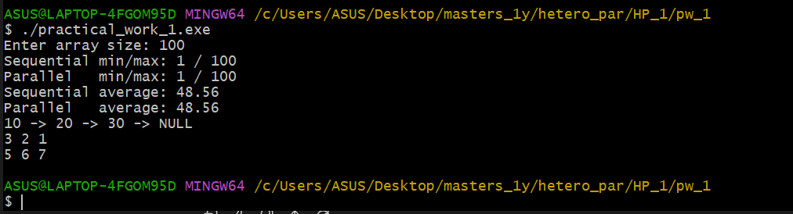
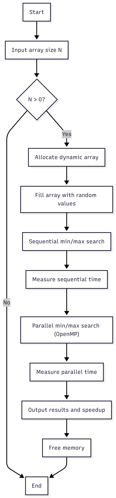
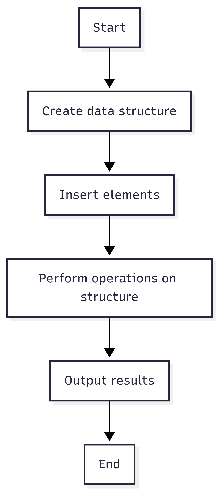
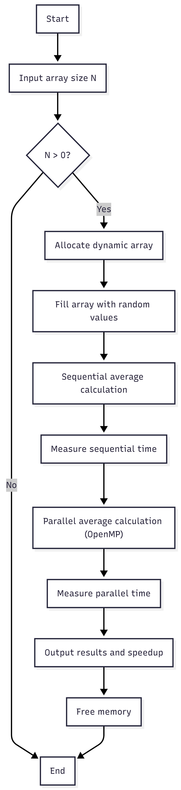

# Практическая работа №1

## Массивы, структуры данных и OpenMP

---

## Описание задания
В этом проекте я изучала работу с динамической памятью в языке программирования C++, а также анализировала различия между последовательными и параллельными алгоритмами обработки массивов с использованием технологии OpenMP.
Что я реализовала:

динамическое выделение и освобождение памяти
обработку массивов большого размера
последовательные и параллельные алгоритмы
измерение времени выполнения программ
сравнение производительности последовательных и параллельных реализаций

## Задание 1 — Массивы: поиск Min/Max

### Цель

Создать массив целых чисел и реализовать алгоритмы поиска минимального и максимального значений с использованием последовательного и параллельного подходов.

### Описание алгоритма

1. Пользователь вводит размер массива `N`.
2. Динамически выделяется память для массива.
3. Массив заполняется случайными целыми числами в диапазоне от 1 до 100.
4. Выполняется последовательный поиск минимального и максимального значений.
5. Измеряется время выполнения последовательного алгоритма.
6. Реализуется параллельный поиск минимального и максимального значений с использованием OpenMP и механизма `reduction`.
7. Измеряется время выполнения параллельного алгоритма.
8. Производится сравнение результатов и времени выполнения.

### Используемые технологии

* Динамическое выделение памяти (`new[]`, `delete[]`);
* Последовательные алгоритмы;
* Параллелизация с использованием OpenMP (`#pragma omp parallel for`);
* Операции редукции (`min`, `max`);
* Измерение времени с помощью библиотеки `std::chrono`.

### Результаты выполнения



### Диаграмма



---

## Задание 2 — Структуры данных

### Цель

Реализовать базовые структуры данных и изучить основные операции над ними.

### Описание алгоритма

1. Реализуются структуры данных: односвязный список, стек и очередь.
2. Выполняются операции добавления и удаления элементов.
3. Реализуется поиск и обход элементов.
4. Отображаются результаты выполнения операций.

### Диаграмма



---

## Задание 3 — Динамическая память и вычисление среднего значения

### Цель

Вычислить среднее значение элементов массива с использованием динамического выделения памяти и сравнить последовательную и параллельную реализации.

### Описание алгоритма

1. Пользователь вводит размер массива `N`.
2. Динамически выделяется память для массива.
3. Массив заполняется случайными целыми числами.
4. Среднее значение вычисляется последовательным способом.
5. Измеряется время выполнения последовательного алгоритма.
6. Среднее значение вычисляется параллельно с использованием OpenMP и механизма `reduction`.
7. Измеряется время выполнения параллельного алгоритма.
8. Сравниваются результаты и время выполнения.

### Используемые технологии

* Динамическая память;
* Последовательные вычисления;
* Параллельные вычисления с использованием OpenMP;
* Операция редукции (`+`);
* Измерение времени (`std::chrono`).

### Диаграмма



---

## Компиляция и запуск программы

Программа компилировалась с использованием компилятора GCC с поддержкой OpenMP.

### Компиляция

```bash
g++ -std=c++17 -fopenmp practical_work_1.cpp -O2 -o practical_work_1.exe
```

### Запуск

```bash
./practical_work_1.exe
```

Во время выполнения программы пользователю предлагается ввести размер массива.

---

## Вывод

В ходе выполнения практической работы были изучены принципы работы с массивами, динамической памятью и базовыми структурами данных в языке C++. Реализованы и сравнены последовательные и параллельные алгоритмы поиска минимального и максимального значений, а также вычисления среднего значения элементов массива. Результаты показывают, что использование OpenMP позволяет сократить время выполнения при обработке больших массивов, однако для небольших объёмов данных выигрыш в производительности может быть незначительным из-за накладных расходов на параллелизацию.

---

# Контрольные вопросы — ответы

### 1. В чём основные отличия между массивами и динамическими структурами данных?

Массивы являются статическими структурами данных с фиксированным размером и хранят элементы в непрерывной области памяти, что обеспечивает быстрый доступ по индексу. Динамические структуры данных (списки, стеки, очереди) используют динамическое выделение памяти и могут изменять свой размер во время выполнения программы, но требуют дополнительной памяти для хранения ссылок между элементами.

---

### 2. Что такое указатель и как он используется в языке C++?

Указатель — это переменная, хранящая адрес другой переменной в памяти. В языке C++ указатели используются для работы с динамической памятью, передачи данных в функции по адресу, а также для реализации динамических структур данных.

---

### 3. Объясните принцип работы стека и очереди.

Стек работает по принципу LIFO (Last In, First Out), при котором последний добавленный элемент извлекается первым. Очередь работает по принципу FIFO (First In, First Out), где первый добавленный элемент извлекается первым.

---

### 4. Каковы преимущества и недостатки односвязных списков по сравнению с массивами?

Преимуществом односвязных списков является возможность динамического изменения размера и эффективное добавление и удаление элементов. Недостатками являются больший расход памяти и более медленный доступ к элементам по сравнению с массивами, так как отсутствует прямой доступ по индексу.

---

### 5. Как правильно освобождать память в языке C++ после работы с динамическими структурами?

Память, выделенная с помощью оператора `new`, должна освобождаться с помощью `delete`, а память, выделенная с помощью `new[]`, — с помощью `delete[]`. Для динамических структур данных необходимо также освобождать память каждого элемента.

---

### 6. Почему важно понимать работу с указателями и динамической памятью для параллельного программирования?

В параллельном программировании несколько потоков могут одновременно обращаться к памяти. Неправильная работа с указателями и динамической памятью может привести к ошибкам синхронизации, утечкам памяти и некорректной работе программы.

---

### 7. Как используется reduction в OpenMP для нахождения суммы, минимума или максимума?

Директива `reduction` создаёт локальные копии переменной для каждого потока. После завершения параллельного участка локальные значения объединяются в одно итоговое значение с использованием указанной операции (например, `+`, `min`, `max`).

---

### 8. Как влияет параллельное программирование на производительность при работе с большими массивами?

При работе с большими массивами параллельное программирование позволяет распределить вычисления между несколькими потоками, что может значительно сократить время выполнения. Однако при малых объёмах данных накладные расходы на создание потоков могут уменьшить или полностью нивелировать прирост производительности.
