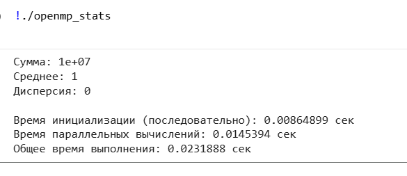
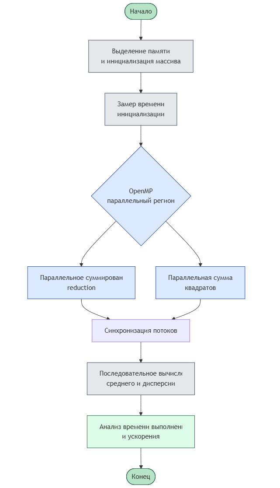
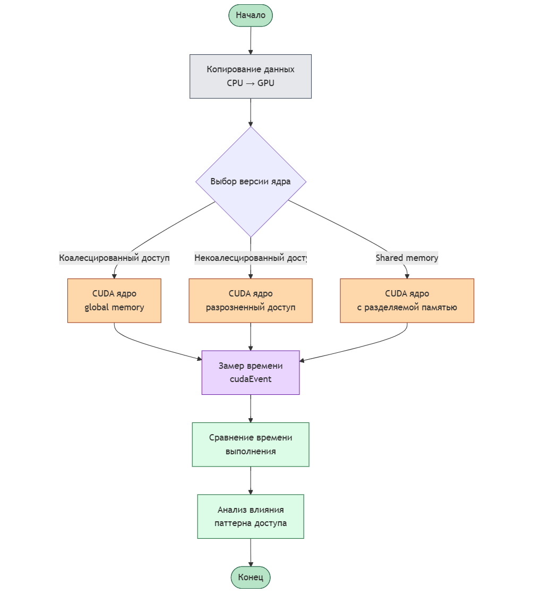
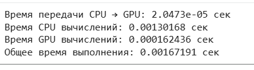
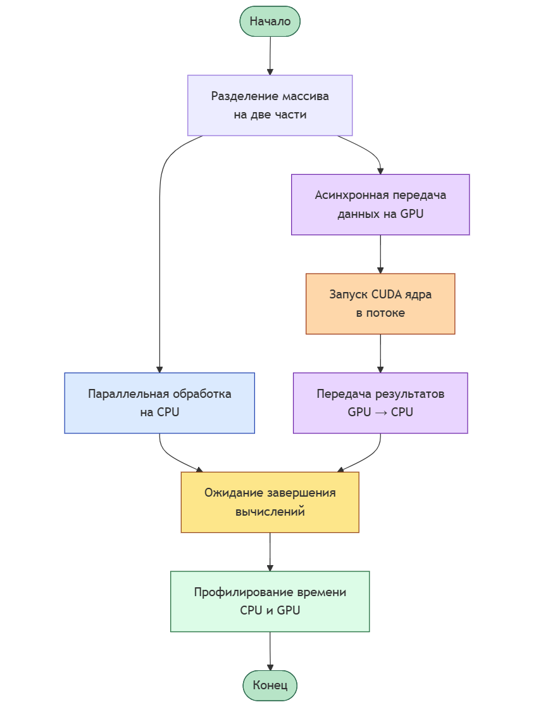
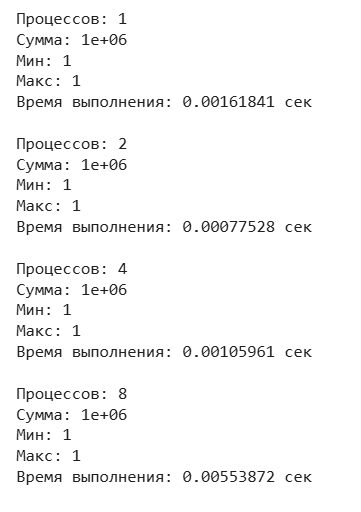
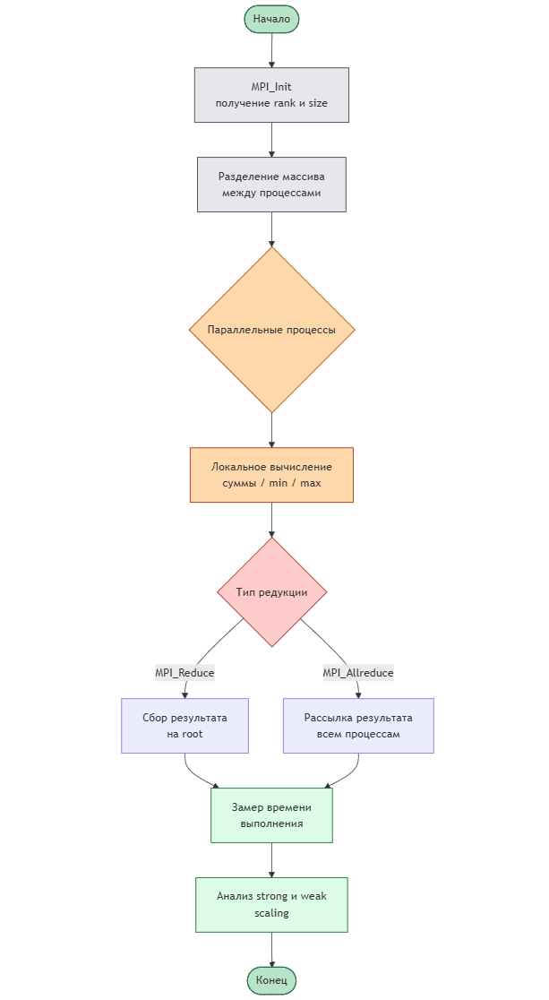

# Практическая работа №10  
## Анализ производительности и масштабируемости параллельных программ

---

## Цель работы

Целью данной практической работы является изучение методов анализа производительности параллельных программ, включая CPU-параллельные приложения (OpenMP), GPU-программы (CUDA), гибридные CPU+GPU приложения и распределённые программы на основе MPI. Особое внимание уделяется профилированию, масштабируемости и выявлению узких мест.

---

## Среда выполнения

- Язык программирования: C++  
- Технологии: OpenMP, CUDA, MPI  
- Среда выполнения: Linux / Google Colab  
- Компиляторы: g++, nvcc, mpic++  

---

## Практическая часть

### Задание 1. Анализ производительности CPU-параллельной программы (OpenMP)

#### Описание

Разработана параллельная программа на C++ с использованием OpenMP для вычисления суммы, среднего значения и дисперсии большого массива данных. Выполнено измерение времени выполнения последовательных и параллельных участков программы с использованием функции `omp_get_wtime()`. Проведён анализ ускорения при различном числе потоков и интерпретация результатов в контексте закона Амдала.

#### Результаты выполнения

#### Блок-схема алгоритма

---

### Задание 2. Оптимизация доступа к памяти на GPU (CUDA)

#### Описание

Реализованы CUDA-ядра с различными паттернами доступа к глобальной памяти: коалесцированным и некоалесцированным. Выполнена оптимизация за счёт использования разделяемой памяти и изменения организации потоков. Время выполнения измерялось с использованием `cudaEvent`.

#### Результаты выполнения

#### Блок-схема алгоритма

---

### Задание 3. Профилирование гибридного приложения CPU + GPU

#### Описание

Разработано гибридное приложение, в котором часть массива обрабатывается на CPU с использованием OpenMP, а другая часть — на GPU с использованием CUDA. Реализована асинхронная передача данных с помощью `cudaMemcpyAsync` и CUDA streams. Проведено профилирование накладных расходов передачи данных и вычислений, а также реализована оптимизация с использованием pinned memory.

#### Результаты выполнения

#### Блок-схема алгоритма

---

### Задание 4. Анализ масштабируемости распределённой программы (MPI)

#### Описание

Реализована распределённая MPI-программа для вычисления агрегатных функций (сумма, минимум, максимум) над большим массивом данных. Измерено время выполнения при различном числе процессов. Проведён анализ strong scaling и weak scaling, а также изучено влияние коллективных операций MPI_Reduce и MPI_Allreduce на производительность.

#### Результаты выполнения

#### Блок-схема алгоритма

---

## Анализ результатов

В ходе выполнения практической работы было показано, что производительность параллельных программ определяется не только количеством потоков или процессов, но и архитектурными особенностями вычислительной системы, характером доступа к памяти и накладными расходами на синхронизацию и обмен данными. Для гибридных и распределённых приложений ключевым фактором становится баланс между вычислениями и коммуникациями.

---

## Выводы

1. Параллелизация на CPU с использованием OpenMP позволяет существенно сократить время выполнения вычислительно интенсивных задач, однако ускорение ограничивается последовательной частью программы.  
2. Для GPU-программ критически важен характер доступа к памяти: коалесцированный доступ и использование разделяемой памяти значительно повышают производительность.  
3. В гибридных приложениях накладные расходы передачи данных между CPU и GPU могут стать узким местом, поэтому важны асинхронные операции и перекрытие вычислений.  
4. Масштабируемость MPI-программ ограничивается стоимостью коллективных операций и коммуникаций между процессами.

---

## Контрольные вопросы

### 1. В чём отличие измерения времени выполнения от профилирования?

Измерение времени выполнения позволяет получить общее время работы программы или отдельных её участков. Профилирование же даёт более детальную информацию о распределении времени между функциями, потоками и операциями, позволяя выявить узкие места и причины снижения производительности.

---

### 2. Какие виды узких мест характерны для CPU, GPU и распределённых программ?

Для CPU-программ узкими местами часто являются последовательные участки кода и синхронизация потоков. Для GPU-программ — доступ к глобальной памяти и неэффективные паттерны обращения к ней. Для распределённых программ основными узкими местами являются коммуникации между процессами и задержки сети.

---

### 3. Почему увеличение числа потоков или процессов не всегда приводит к ускорению?

Увеличение числа потоков или процессов приводит к росту накладных расходов на синхронизацию и обмен данными. Кроме того, согласно закону Амдала, наличие последовательной части программы ограничивает максимальное возможное ускорение.

---

### 4. Как законы Амдала и Густафсона применяются при анализе масштабируемости?

Закон Амдала показывает ограничение ускорения при фиксированном размере задачи и увеличении числа вычислительных ресурсов. Закон Густафсона учитывает рост размера задачи вместе с числом процессоров и демонстрирует, что при увеличении объёма вычислений масштабируемость может быть значительно лучше.

---

### 5. Какие факторы наиболее критичны для производительности гибридных приложений?

Наиболее критичными факторами являются скорость передачи данных между CPU и GPU, эффективность перекрытия вычислений и коммуникаций, баланс нагрузки между CPU и GPU, а также выбор оптимальных параметров запуска вычислительных ядер.

---
