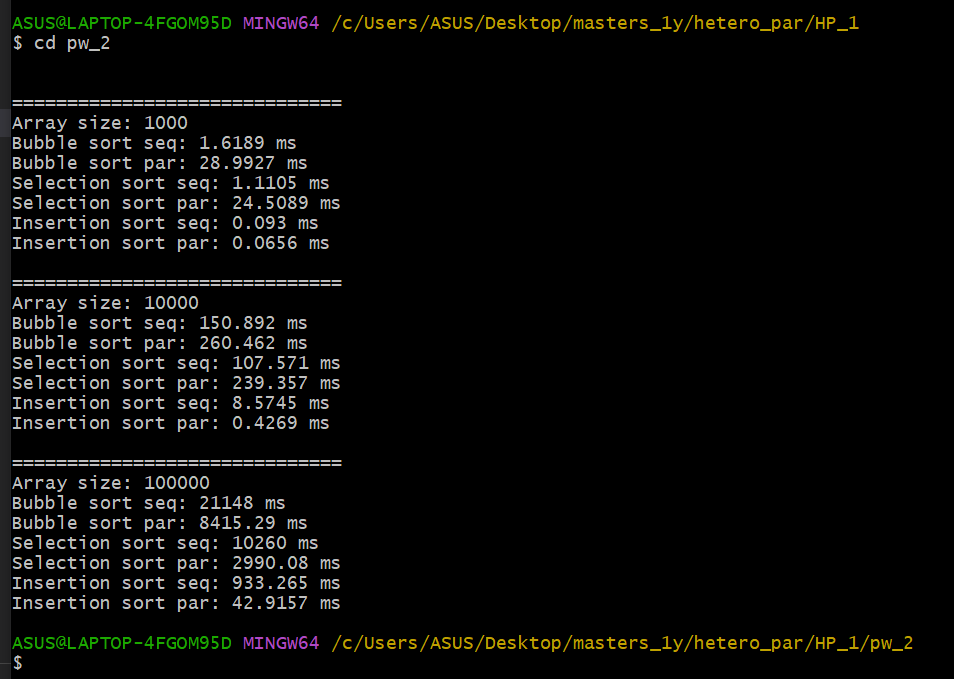
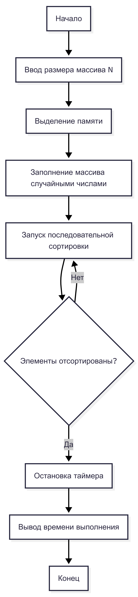
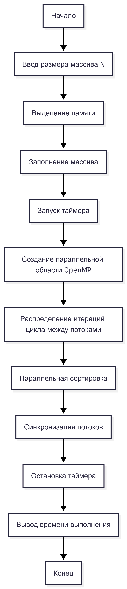

# Практическая работа №2

## Параллельная реализация алгоритмов сортировки с использованием OpenMP

---

## Описание практической работы

В данной практической работе я изучала принципы параллельного программирования на CPU с использованием технологии OpenMP. В рамках работы я реализовала и проанализировала простые алгоритмы сортировки, такие как сортировка пузырьком, выбором и вставкой, в последовательном и параллельном вариантах.

Основной целью работы было сравнение производительности последовательных и параллельных реализаций алгоритмов сортировки на массивах различного размера.

---

## Цель работы

* Освоить основы параллельного программирования с использованием OpenMP
* Реализовать базовые алгоритмы сортировки в последовательном и параллельном вариантах
* Сравнить производительность последовательных и параллельных алгоритмов сортировки

---

## Что было реализовано

В ходе выполнения практической работы я:

* реализовала последовательные алгоритмы сортировки:

  * сортировку пузырьком (Bubble Sort);
  * сортировку выбором (Selection Sort);
  * сортировку вставкой (Insertion Sort);
* реализовала параллельные версии данных алгоритмов с использованием директивы OpenMP `#pragma omp parallel for`;
* сгенерировала массивы случайных чисел различных размеров;
* измерила время выполнения последовательных и параллельных алгоритмов с помощью библиотеки `std::chrono`;
* сравнила полученные результаты и проанализировала влияние параллелизации на производительность.

---

## Описание алгоритма работы программы

1. Генерируется массив случайных целых чисел заданного размера.
2. Для корректного сравнения массив копируется перед каждой сортировкой.
3. Выполняется последовательная сортировка массива.
4. Измеряется время выполнения последовательного алгоритма.
5. Выполняется параллельная сортировка массива с использованием OpenMP.
6. Измеряется время выполнения параллельного алгоритма.
7. Результаты времени выполнения выводятся в консоль.
8. Операции повторяются для различных алгоритмов сортировки и размеров массивов.

---

## Результаты выполнения программы

Ниже представлен пример вывода программы в консоль, содержащий результаты измерения времени выполнения последовательных и параллельных алгоритмов сортировки:



---

## Блок-схемы алгоритмов

### Последовательная сортировка

Блок-схема ниже отражает общий принцип работы последовательных алгоритмов сортировки, при котором все операции выполняются в одном потоке.



---

### Параллельная сортировка (OpenMP)

Блок-схема ниже отражает принцип работы параллельной сортировки с использованием OpenMP, где итерации циклов распределяются между несколькими потоками.



---

## Используемые технологии и инструменты

* Язык программирования C++
* Параллельное программирование с использованием OpenMP
* Алгоритмы сортировки: Bubble Sort, Selection Sort, Insertion Sort
* Измерение времени выполнения с помощью `std::chrono`
* Компилятор GCC с поддержкой OpenMP

---

## Компиляция и запуск программы

### Компиляция

```bash
g++ -std=c++17 -fopenmp practical_work_2.cpp -O2 -o practical_work_2.exe
```

### Запуск

```bash
./practical_work_2.exe
```

Во время выполнения программа автоматически выполняет тестирование алгоритмов сортировки на массивах различного размера и выводит результаты в консоль.

---

## Вывод

В ходе выполнения данной практической работы я изучила принципы параллельного программирования с использованием OpenMP и реализовала последовательные и параллельные версии простых алгоритмов сортировки. Полученные результаты показывают, что параллельная реализация может улучшить производительность на больших массивах, однако для некоторых алгоритмов, таких как сортировка вставкой, эффект параллелизации является незначительным из-за зависимости операций друг от друга и накладных расходов на создание потоков.

---


## Контрольные вопросы — ответы

### 1. В чём основные отличия алгоритмов сортировки пузырьком, выбором и вставкой?

Сортировка пузырьком основана на многократном сравнении соседних элементов и их перестановке до тех пор, пока массив не будет отсортирован. Сортировка выбором на каждом шаге находит минимальный элемент в неотсортированной части массива и перемещает его в начало. Сортировка вставкой формирует отсортированную часть массива, поочерёдно вставляя элементы на правильную позицию. Все три алгоритма имеют квадратичную сложность `O(n²)`, но различаются по числу сравнений и перестановок.

---

### 2. Почему параллельная реализация сортировки вставкой сложнее для выполнения с использованием OpenMP?

Сортировка вставкой имеет сильную зависимость между итерациями, так как каждый следующий шаг использует результаты предыдущего. Из-за этого невозможно эффективно распараллелить алгоритм без нарушения корректности работы. Параллельная реализация сортировки вставкой, как правило, не даёт значительного ускорения и используется в учебных целях.

---

### 3. Какие директивы OpenMP были использованы для параллельной реализации алгоритмов?

Для параллельной реализации алгоритмов сортировки использовалась директива `#pragma omp parallel for`, которая позволяет распределять итерации циклов между несколькими потоками. В некоторых случаях также применялась директива `critical` для предотвращения конфликтов при доступе к общим данным.

---

### 4. Какие преимущества и недостатки параллельной реализации алгоритмов сортировки на CPU?

К преимуществам параллельной реализации относится возможность ускорения выполнения алгоритмов за счёт распределения вычислений между несколькими потоками. К недостаткам относятся накладные расходы на создание и синхронизацию потоков, а также ограниченная эффективность параллелизации для алгоритмов с сильной зависимостью между операциями.

---

### 5. Как можно измерить производительность программы в C++?

Производительность программы в C++ можно измерить с помощью библиотеки `std::chrono`, которая позволяет зафиксировать время начала и окончания выполнения алгоритма и вычислить длительность его работы с высокой точностью.

---

### 6. Как изменяется производительность сортировок при увеличении числа потоков?

При увеличении числа потоков производительность может улучшаться за счёт параллельного выполнения операций, особенно на больших массивах данных. Однако после определённого количества потоков прирост производительности уменьшается из-за накладных расходов и ограничений аппаратных ресурсов.

---

### 7. В каких ситуациях параллельная сортировка может быть менее эффективной, чем последовательная?

Параллельная сортировка может быть менее эффективной при работе с небольшими массивами, а также для алгоритмов, которые плохо поддаются параллелизации. В таких случаях накладные расходы на управление потоками могут превышать выигрыш от параллельного выполнения.
