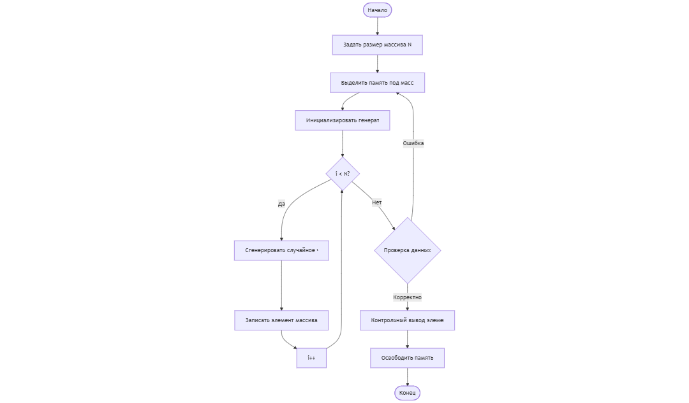
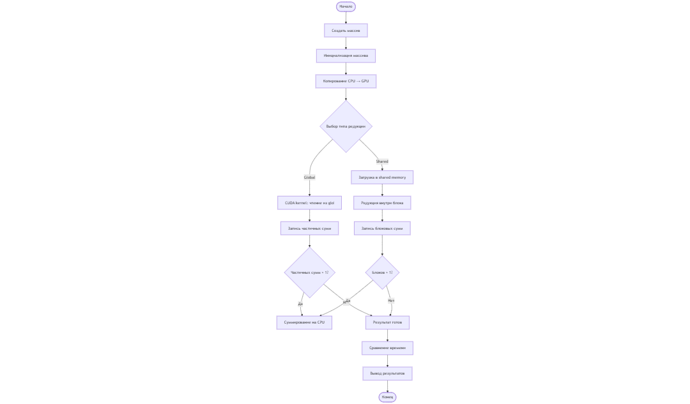
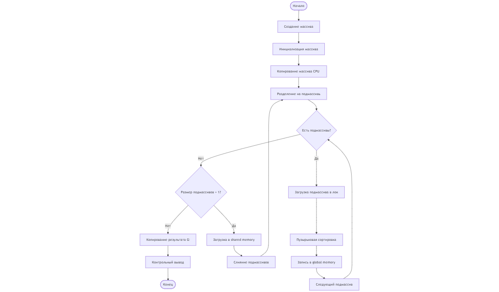
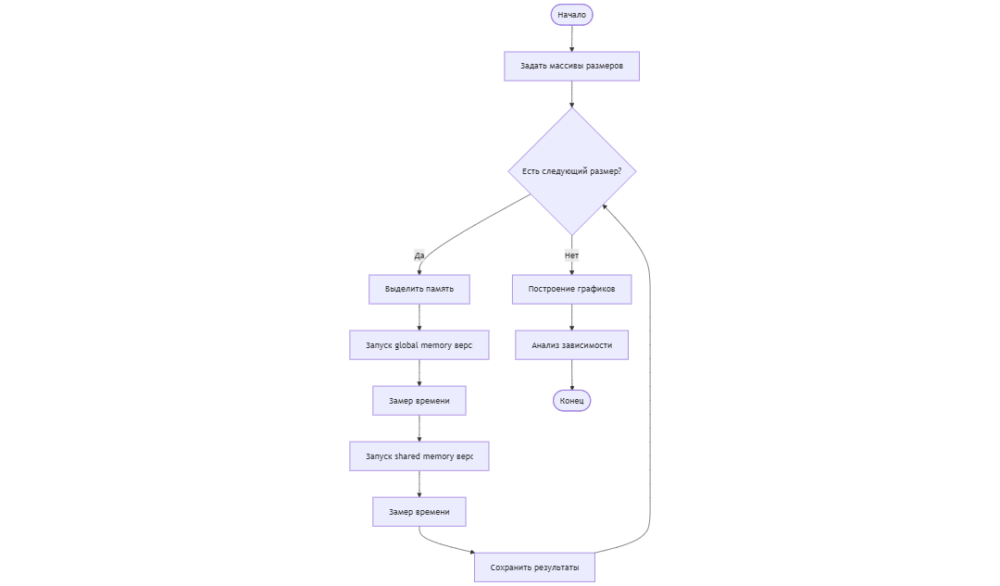

### Блок-схемы

Блок схема 1 задания

Блок схема 2 задания

Блок схема 3 задания

Блок схема 4 задания

Контрольные вопросы
1. Чем отличаются типы памяти в CUDA и в каких случаях их использовать?

В CUDA используются несколько типов памяти, отличающихся по скорости доступа и области применения. Регистры являются самой быстрой памятью и используются для хранения локальных переменных потока. Разделяемая память применяется для обмена данными между потоками одного блока и имеет низкую задержку доступа. Глобальная память обладает большим объёмом, но высокой задержкой, поэтому используется для хранения основных данных. Константная и текстурная память оптимизированы для операций чтения и применяются для неизменяемых данных.

2. Как использование разделяемой памяти влияет на производительность?

Использование разделяемой памяти снижает количество обращений к глобальной памяти, что уменьшает задержки доступа. Это особенно эффективно в алгоритмах, где данные многократно используются потоками одного блока, например при редукции или сортировке. В результате повышается пропускная способность и уменьшается общее время выполнения программы.

3. Что такое коалесцированный доступ к памяти и как его обеспечить?

Коалесцированный доступ — это способ обращения к глобальной памяти, при котором соседние потоки обращаются к последовательным адресам памяти. Такой доступ позволяет GPU объединять несколько операций чтения или записи в одну транзакцию. Для его обеспечения необходимо правильно организовать структуру данных и индексацию потоков.

4. Какие сложности возникают при работе с большим объёмом данных на GPU?

Основные сложности связаны с ограниченной пропускной способностью глобальной памяти, накладными расходами на передачу данных между CPU и GPU, а также ограничениями по объёму доступной памяти GPU. При неправильной организации данных возможны потери производительности из-за некоалесцированного доступа и избыточных обращений к памяти.

5. Почему важно минимизировать доступ к глобальной памяти?

Глобальная память имеет высокую задержку доступа по сравнению с регистрами и разделяемой памятью. Частые обращения к ней значительно замедляют выполнение программы. Минимизация доступа к глобальной памяти и использование более быстрых типов памяти позволяют существенно повысить производительность CUDA-программ.

6. Как использовать профилирование для анализа производительности CUDA-программ?

Профилирование позволяет выявить узкие места в CUDA-программах, такие как неэффективный доступ к памяти или низкая загрузка вычислительных блоков. Для этого используются инструменты NVIDIA, например Nsight Systems и Nsight Compute, которые позволяют анализировать время выполнения ядер, использование памяти и степень параллелизма.