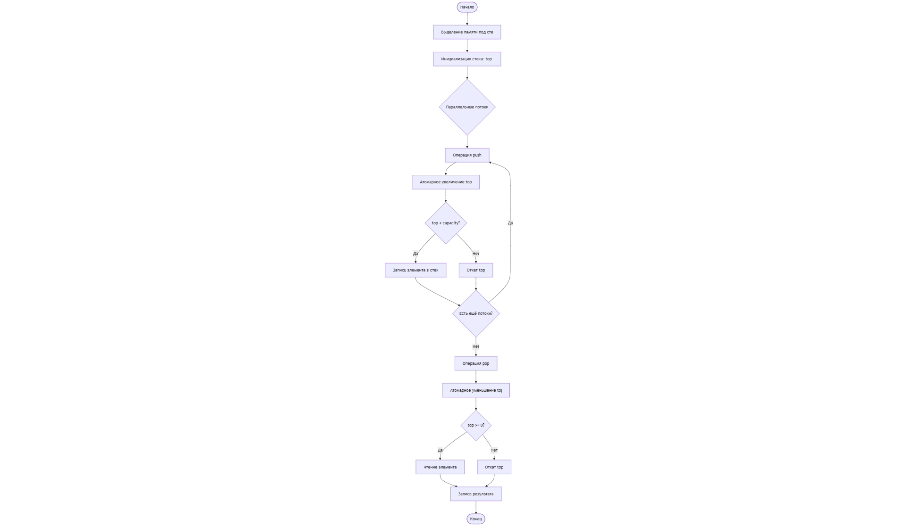
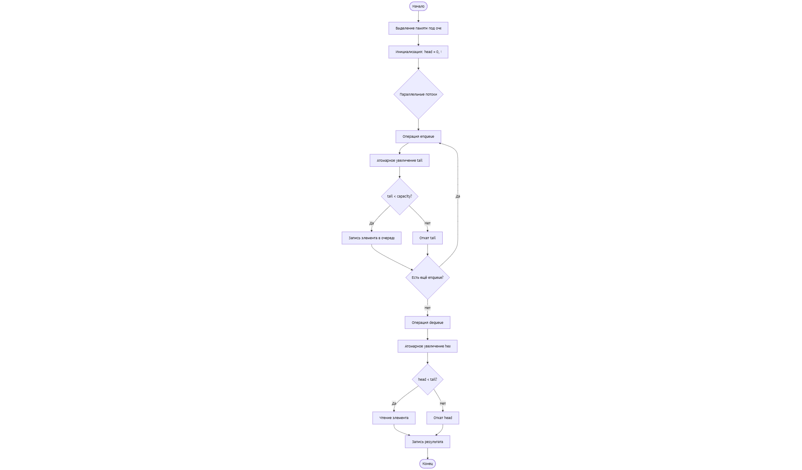

### Блок-схемы

Блок схема 1 задания

Блок схема 2 задания

Контрольные вопросы
1. В чём отличие стека и очереди?

Стек и очередь отличаются принципом доступа к данным. Стек реализует стратегию LIFO (последним пришёл — первым вышел), тогда как очередь использует стратегию FIFO (первым пришёл — первым вышел). Это определяет порядок обработки элементов и область применения каждой структуры данных.

2. Какие проблемы возникают при параллельном доступе к данным?

При параллельном доступе к данным возможны состояния гонки, когда несколько потоков одновременно изменяют общие данные. Это может приводить к потере данных, некорректным значениям и непредсказуемому поведению программы. Без механизмов синхронизации корректность работы параллельных структур данных не гарантируется.

3. Как атомарные операции помогают избежать конфликтов в параллельных структурах данных?

Атомарные операции обеспечивают неделимое выполнение операций чтения и записи над общими переменными. Это гарантирует, что обновление состояния структуры данных, например указателей вершины стека или головы очереди, выполняется корректно даже при одновременном доступе нескольких потоков.

4. Какие типы памяти CUDA используются для хранения данных?

В CUDA используются регистры, локальная память, разделяемая память и глобальная память. Регистры и локальная память применяются для хранения временных данных потоков, разделяемая память используется для быстрого обмена данными между потоками одного блока, а глобальная память предназначена для хранения основных структур данных, доступных всем потокам.

5. Как синхронизация потоков влияет на производительность?

Синхронизация потоков необходима для корректного доступа к общим данным, однако она увеличивает накладные расходы и может снижать производительность. Частое использование синхронизации ограничивает параллелизм, поэтому важно применять её только там, где это действительно необходимо.

6. Почему разделяемая память важна для оптимизации работы параллельных структур данных?

Разделяемая память имеет значительно меньшую задержку доступа по сравнению с глобальной памятью. Использование разделяемой памяти позволяет сократить число обращений к глобальной памяти, ускорить обмен данными между потоками и повысить общую производительность параллельных структур данных.