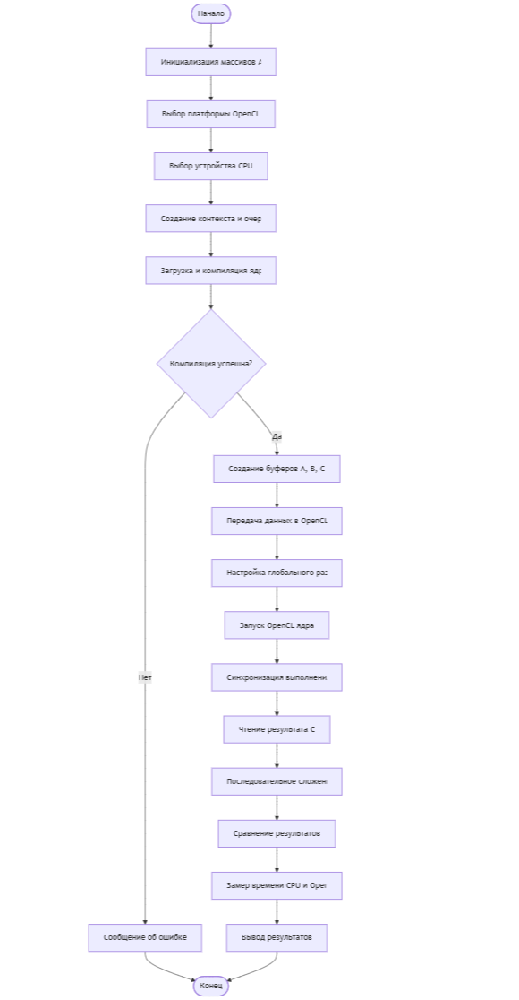
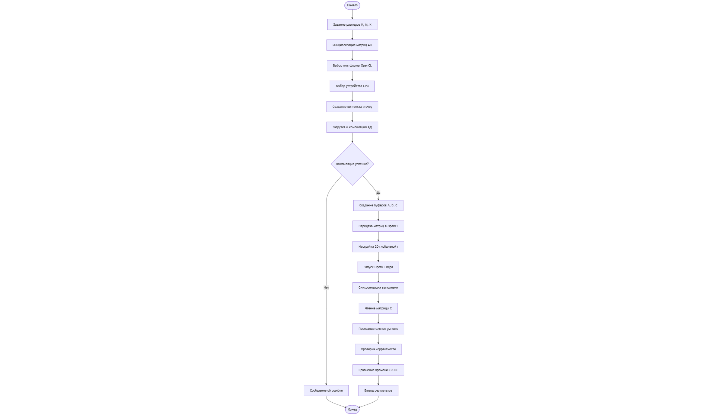

Практическая работа 6
Использование OpenCL для параллельных вычислений
Целью данной практической работы является изучение технологии OpenCL и её применения для параллельных вычислений на примере операций сложения векторов и умножения матриц, а также сравнение производительности OpenCL и последовательной реализации на CPU.

Среда: Google Colab

Реализация OpenCL: POCL (CPU)

Язык программирования: C / C++

GPU OpenCL в Colab недоступен, поэтому выполнение OpenCL осуществляется на CPU

Задача №1. Сложение векторов
Описание

Реализовано OpenCL-ядро для поэлементного сложения двух массивов.
Результат сравнивается с последовательной реализацией на CPU.

Результаты выполнения

Блок-схема алгоритма

Задача №2. Параллельное умножение матриц
Описание

Реализовано OpenCL-ядро для умножения матриц размеров N×M и M×K.
Корректность проверяется сравнением с последовательным алгоритмом на CPU.

Результаты выполнения

Блок-схема алгоритма

Сравнение производительности
Реализация	Время выполнения
CPU (последовательно)	[вставить значение]
OpenCL (CPU, POCL)	[вставить значение]

В среде Google Colab OpenCL выполняется на CPU, поэтому ускорение по сравнению с последовательной реализацией ограничено. Основной целью являлась демонстрация корректной работы OpenCL-программы.

Вывод

В ходе работы были реализованы программы для параллельного сложения векторов и умножения матриц с использованием OpenCL. Несмотря на ограничения среды выполнения, полученные результаты подтверждают корректность работы OpenCL-ядер и демонстрируют принципы организации параллельных вычислений.

Контрольные вопросы
1. Какие основные типы памяти используются в OpenCL?

В OpenCL используются глобальная, локальная, приватная и константная память. Глобальная память доступна всем рабочим элементам, локальная используется внутри рабочей группы, приватная принадлежит одному рабочему элементу, а константная предназначена для неизменяемых данных.

2. Как настроить глобальную и локальную рабочую группу?

Глобальный размер рабочей группы задаёт общее количество рабочих элементов, а локальный размер определяет количество рабочих элементов в одной группе. Эти параметры передаются при запуске ядра и должны соответствовать размерности обрабатываемых данных.

3. Чем отличается OpenCL от CUDA?

OpenCL является кроссплатформенной технологией и поддерживает различные типы устройств, включая CPU и GPU разных производителей. CUDA является проприетарной технологией NVIDIA и работает только на их графических процессорах.

4. Какие преимущества дает использование OpenCL?

Основными преимуществами OpenCL являются переносимость кода, возможность выполнения на различных вычислительных устройствах и единый программный интерфейс для гетерогенных систем.