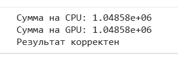
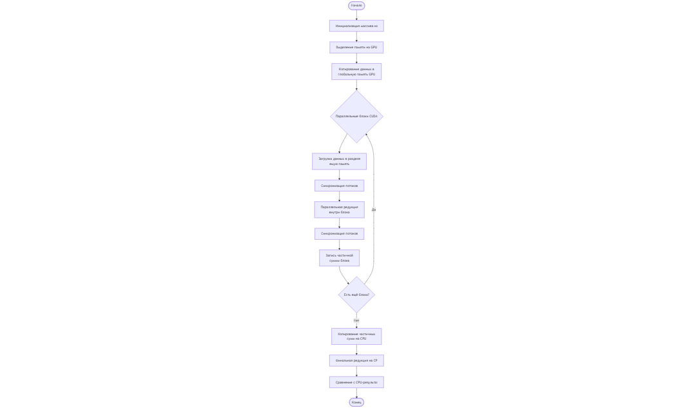
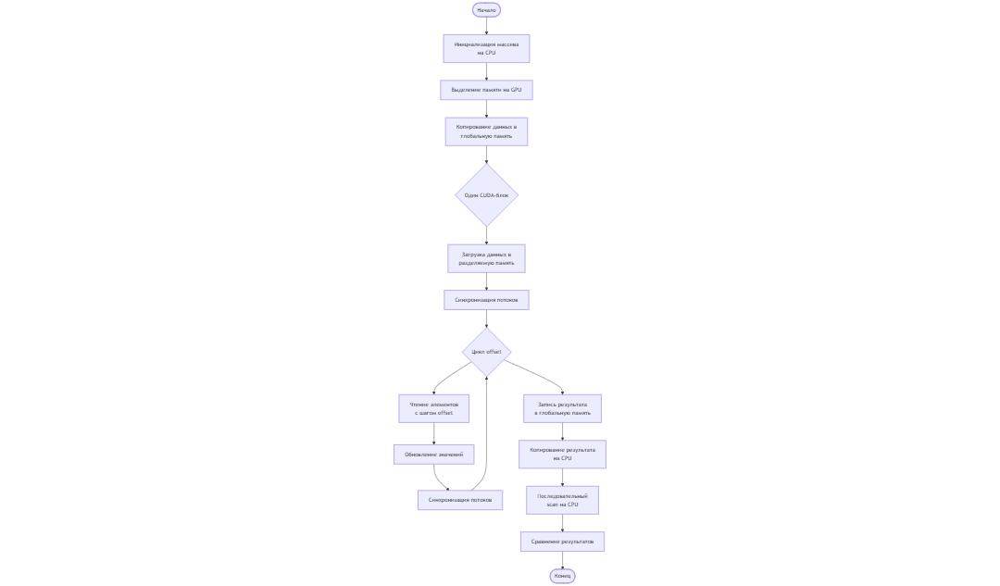
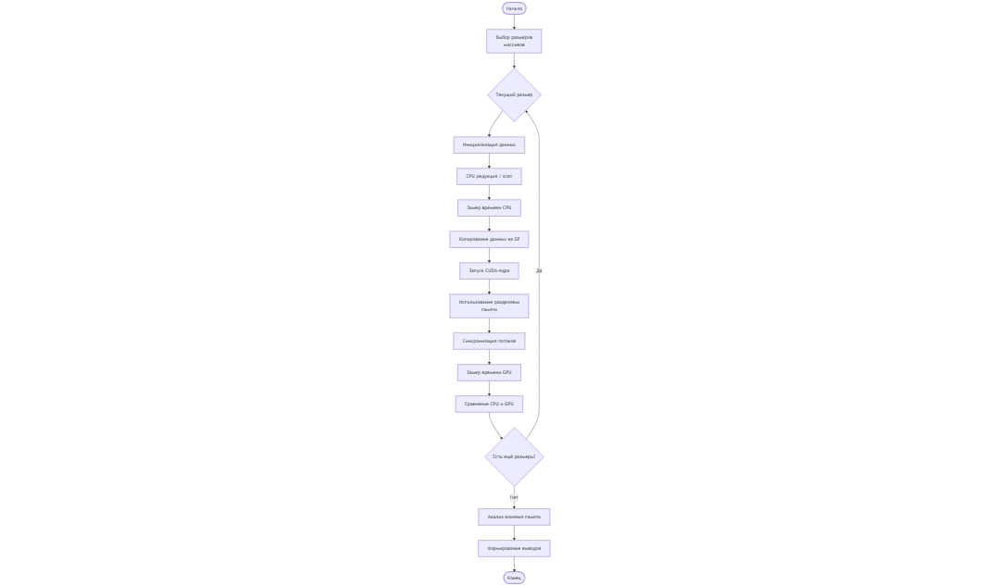

# Практическая работа 7  
## Редукция и префиксная сумма на CUDA

---

## Цель работы

Целью данной практической работы является изучение и реализация параллельных алгоритмов редукции и префиксной суммы (сканирования) с использованием технологии CUDA, а также анализ их производительности по сравнению с последовательными реализациями на CPU.

---

## Теоретическая часть

### Редукция

Редукция — это параллельный алгоритм, предназначенный для свёртки массива данных в одно итоговое значение, например вычисление суммы, минимума или максимума элементов. В CUDA редукция обычно реализуется с использованием разделяемой памяти для уменьшения числа обращений к глобальной памяти и ускорения вычислений.

### Префиксная сумма (сканирование)

Префиксная сумма (scan) — это операция, при которой каждый элемент выходного массива представляет собой сумму всех предыдущих элементов входного массива. Сканирование широко применяется в параллельных алгоритмах, таких как сортировка, построение гистограмм и обработка потоков данных.

---

## Практическая часть

### Задание 1. Реализация редукции

#### Описание

Реализовано CUDA-ядро для параллельного суммирования элементов массива с использованием разделяемой памяти. Корректность работы проверена сравнением с последовательной реализацией на CPU.

#### Результаты выполнения

#### Блок-схема алгоритма редукции

---

### Задание 2. Реализация префиксной суммы

#### Описание

Реализовано CUDA-ядро для вычисления префиксной суммы массива с использованием разделяемой памяти. Алгоритм реализован в пределах одного блока для наглядности и упрощения анализа.

#### Результаты выполнения

#### Блок-схема алгоритма префиксной суммы

---

### Задание 3. Анализ производительности

#### Описание

Выполнены замеры времени выполнения редукции и префиксной суммы для массивов различных размеров. Результаты CUDA-реализаций сравнивались с последовательными реализациями на CPU.

#### Графики производительности

---

## Анализ результатов

Результаты экспериментов показывают, что для небольших массивов последовательная реализация на CPU может быть сопоставима по времени с CUDA-реализацией из-за накладных расходов на запуск CUDA-ядер. При увеличении размера массива параллельная реализация на GPU демонстрирует более высокую эффективность, особенно для задачи редукции.

---

## Сравнение производительности CPU и GPU

GPU-реализация позволяет эффективно обрабатывать большие объёмы данных за счёт массового параллелизма и использования разделяемой памяти. CPU-реализация остаётся более простой, но уступает по производительности при росте размера входных данных.

---

## Рекомендации по оптимизации

- Минимизировать обращения к глобальной памяти.
- Использовать разделяемую память для часто используемых данных.
- Подбирать оптимальный размер блока потоков.
- Применять более эффективные алгоритмы сканирования (например, Blelloch scan).

---

## Выводы

В ходе практической работы были реализованы и исследованы параллельные алгоритмы редукции и префиксной суммы на CUDA. Сравнение с последовательными реализациями подтвердило преимущества GPU при обработке больших массивов данных и показало важность оптимизации доступа к памяти.

---

## Контрольные вопросы

### 1. В чём разница между редукцией и сканированием?

Редукция сводит массив данных к одному итоговому значению, тогда как сканирование формирует массив префиксных значений, где каждый элемент зависит от предыдущих элементов входного массива.

---

### 2. Какие типы памяти CUDA используются для оптимизации редукции и сканирования?

Для оптимизации используются разделяемая память для быстрого обмена данными между потоками одного блока и регистры для хранения временных переменных. Глобальная память применяется для хранения исходных и итоговых данных.

---

### 3. Как можно оптимизировать префиксную сумму на GPU?

Префиксную сумму можно оптимизировать за счёт использования более эффективных алгоритмов, уменьшения числа синхронизаций, применения warp-level операций и оптимального выбора конфигурации блоков потоков.

---

### 4. Приведите пример задачи, где применяется сканирование.

Сканирование используется в задачах параллельной сортировки, построения гистограмм, обработки потоков данных и реализации алгоритмов распределения нагрузки.

---
