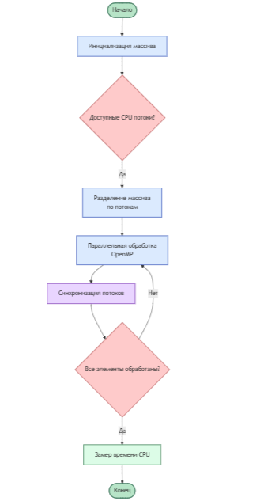
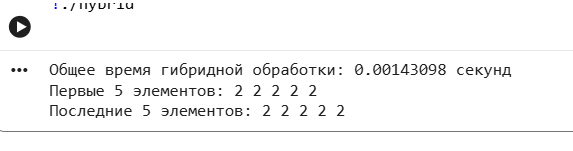
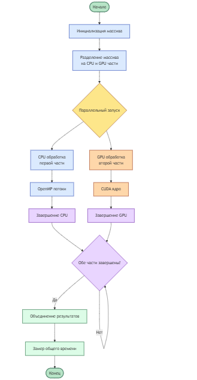
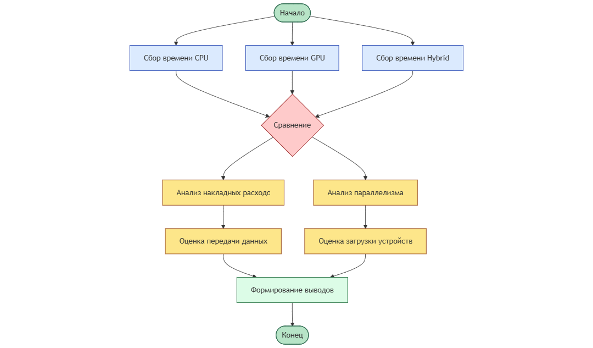

# Практическая работа №8  
## Разработка гибридного приложения для CPU и GPU

---

## Цель работы

Целью данной практической работы является разработка гибридного приложения, распределяющего вычисления между CPU и GPU для обработки массива данных, а также изучение принципов гибридных вычислений, передачи данных между CPU и GPU и анализа производительности.

---

## Теоретическая часть

### Гибридные вычисления

Гибридные вычисления представляют собой подход, при котором вычислительная нагрузка распределяется между CPU и GPU. CPU используется для управления программой и выполнения последовательных или слабо параллельных задач, тогда как GPU применяется для массово-параллельных вычислений.

### OpenMP

OpenMP — это API для параллельного программирования на CPU, позволяющее распараллеливать циклы и вычисления с использованием многопоточности.

### CUDA

CUDA — платформа для параллельных вычислений на GPU, позволяющая использовать большое количество потоков для ускорения вычислений.

### Передача данных между CPU и GPU

Передача данных между CPU и GPU осуществляется через шину PCI Express и может являться узким местом производительности, поэтому количество таких передач должно быть минимизировано.

---

## Практическая часть

### Задание 1. Обработка массива на CPU с использованием OpenMP

#### Описание

Реализована параллельная обработка массива данных размером `N = 1 000 000` элементов на CPU с использованием OpenMP. Каждый элемент массива умножается на 2. Выполнен замер времени выполнения.

#### Результаты выполнения

#### Блок-схема алгоритма

---

### Задание 2. Обработка массива на GPU с использованием CUDA

#### Описание

Реализована обработка массива данных на GPU с использованием CUDA. Данные копируются из памяти CPU в память GPU, обрабатываются параллельным CUDA-ядром и возвращаются обратно на CPU. Выполнен замер времени выполнения.

#### Результаты выполнения

#### Блок-схема алгоритма

---

### Задание 3. Гибридная обработка массива (CPU + GPU)

#### Описание

Реализована гибридная обработка массива, при которой первая половина массива обрабатывается на CPU с использованием OpenMP, а вторая половина — на GPU с использованием CUDA. CPU и GPU выполняют вычисления параллельно. Замерено общее время выполнения.

#### Результаты выполнения

#### Блок-схема алгоритма

---

### Задание 4. Анализ производительности

#### Описание

Выполнено сравнение времени выполнения обработки массива в трёх режимах:
- CPU (OpenMP),
- GPU (CUDA),
- гибридный режим (CPU + GPU).

Проведён анализ эффективности гибридного подхода.

#### Результаты сравнения

---

## Анализ результатов

Результаты экспериментов показывают, что GPU обеспечивает высокую производительность при массово-параллельной обработке данных. Гибридный подход позволяет задействовать ресурсы CPU и GPU одновременно и может обеспечить наименьшее общее время выполнения при корректной балансировке нагрузки и минимальных затратах на передачу данных.

---

## Сравнение CPU, GPU и гибридного подходов

- **CPU (OpenMP):** эффективен для умеренных объёмов данных и простых операций.
- **GPU (CUDA):** наиболее эффективен для больших массивов и параллельных вычислений.
- **Гибридный подход:** позволяет максимально использовать вычислительные ресурсы системы и обеспечивает наибольший выигрыш при больших объёмах данных.

---

## Выводы

В ходе практической работы было реализовано гибридное приложение для обработки массива данных с использованием CPU и GPU. Экспериментальные результаты подтвердили эффективность гибридных вычислений и показали, что наибольший выигрыш достигается при параллельной работе CPU и GPU и минимизации передачи данных между ними.

---
