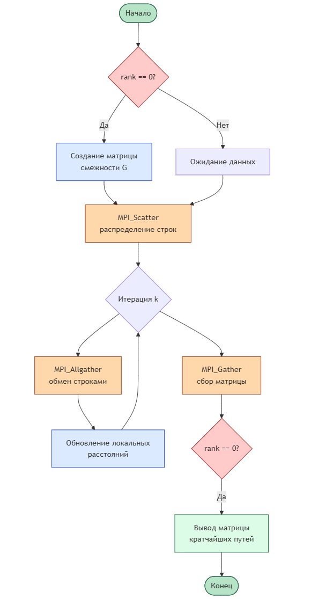
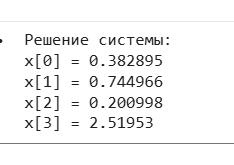
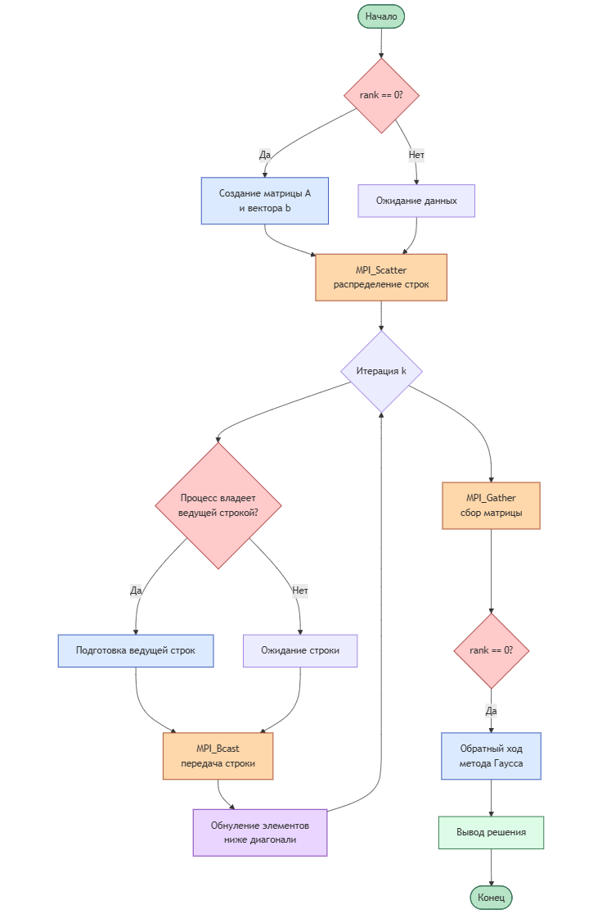
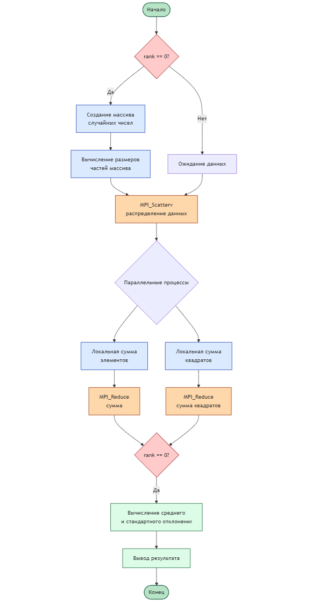

# Практическая работа №9  
## Распределённая обработка данных с использованием MPI

---

## Цель работы

Целью данной практической работы является изучение продвинутых механизмов MPI, включая передачу сообщений, коллективные операции и распределённую обработку данных, а также анализ производительности и масштабируемости параллельных программ.

---

## Среда выполнения

- Язык программирования: C++  
- Библиотека: MPI (Open MPI)  
- Среда выполнения: Linux / Google Colab  
- Компиляция: mpic++

---

## Практическая часть

### Задание 1. Распределённое вычисление среднего значения и стандартного отклонения

#### Описание

Реализована MPI-программа для распределённого вычисления среднего значения и стандартного отклонения массива данных. Массив создаётся на процессе с `rank = 0` и распределяется между процессами с использованием `MPI_Scatterv`, что позволяет учитывать остаток при неравномерном делении данных. Локальные суммы и суммы квадратов элементов собираются с помощью `MPI_Reduce`.

#### Результаты выполнения

#### Блок-схема алгоритма

---

### Задание 2. Распределённое решение системы линейных уравнений методом Гаусса

#### Описание

Реализована распределённая версия метода Гаусса для решения системы линейных уравнений. Строки матрицы коэффициентов распределяются между процессами с помощью `MPI_Scatter`. В процессе прямого хода ведущая строка передаётся всем процессам с использованием `MPI_Bcast`. После завершения прямого хода данные собираются на процессе с `rank = 0`, где выполняется обратный ход и выводится решение системы.

#### Результаты выполнения

#### Блок-схема алгоритма

---

### Задание 3. Параллельный анализ графов (алгоритм Флойда–Уоршелла)

#### Описание

Реализована параллельная версия алгоритма Флойда–Уоршелла для поиска кратчайших путей в графе. Матрица смежности распределяется между процессами построчно с использованием `MPI_Scatter`. На каждой итерации алгоритма обновлённые данные обмениваются между всеми процессами с помощью `MPI_Allgather`, что обеспечивает корректность вычислений.

#### Результаты выполнения

#### Блок-схема алгоритма

---

## Анализ производительности и масштабируемости

В ходе выполнения заданий было установлено, что увеличение числа процессов позволяет сократить время вычислений за счёт распределения нагрузки. Однако эффективность масштабирования ограничивается накладными расходами на передачу данных и синхронизацию между процессами. Для задач с интенсивными вычислениями выигрыш от параллелизма проявляется сильнее, чем для задач с частыми коммуникациями.

---

## Выводы

В рамках практической работы были реализованы три распределённые программы с использованием MPI, демонстрирующие различные аспекты параллельной обработки данных. Полученные результаты подтвердили эффективность коллективных операций MPI и показали важность оптимального баланса между вычислениями и коммуникациями.

---

## Контрольные вопросы

### 1. Как изменяется время выполнения программы при увеличении количества процессов? Почему?

При увеличении количества процессов время выполнения, как правило, уменьшается за счёт распределения вычислительной нагрузки. Однако после определённого числа процессов ускорение замедляется или прекращается из-за роста накладных расходов на обмен данными и синхронизацию.

---

### 2. Какие факторы могут влиять на производительность программы?

На производительность влияют объём передаваемых данных, частота коммуникаций между процессами, структура алгоритма, баланс нагрузки между процессами, пропускная способность сети и задержки передачи сообщений.

---

### 3. Как можно оптимизировать передачу данных между процессами?

Передачу данных можно оптимизировать за счёт уменьшения количества сообщений, использования коллективных операций MPI, агрегации данных, а также перекрытия вычислений и коммуникаций.

---

### 4. Какие ограничения возникают при работе с большими данными?

Основные ограничения связаны с объёмом доступной памяти, пропускной способностью сети, временем передачи данных и сложностью синхронизации большого числа процессов.

---
